# Glosario Técnico de Conceptos OpenCode

**Versión:** 1.1  
**Fecha:** 5 de mayo de 2026  
**Idioma:** Español (España)  
**Propósito:** Documento de referencia para comprender el ecosistema OpenCode y facilitar la interpretación de informes técnicos  
**Actualización:** Añadida sección 6 "Sistemas de Control y Aprobación" con OpenAgentsControl (OAC)

---

## Índice de Contenidos

1. [Infraestructura y Aislamiento](#1-infraestructura-y-aislamiento)
   - [Git Worktrees](#git-worktrees)
   - [Ejecución de Agentes en Git Worktrees Aislados](#ejecución-de-agentes-en-git-worktrees-aislados)
   - [Sesiones Terminales Dedicadas por Agente](#sesiones-terminales-dedicadas-por-agente)
2. [Coordinación de Agentes](#2-coordinación-de-agentes)
   - [Múltiples Agentes en Paralelo](#múltiples-agentes-en-paralelo)
   - [Mensajería, Tareas Compartidas y Coordinación entre Agentes](#mensajería-tareas-compartidas-y-coordinación-entre-agentes)
   - [Sesión Independiente y Ventana de Contexto por Agente](#sesión-independiente-y-ventana-de-contexto-por-agente)
   - [Modelo Arquitectónico Role + Worker](#modelo-arquitectónico-role--worker)
   - [Role-Hub para Gestión de Roles Remotos](#role-hub-para-gestión-de-roles-remotos)
3. [Herramientas y Extensiones](#3-herramientas-y-extensiones)
   - [Bundle de Componentes](#bundle-de-componentes)
   - [Plugins Genéricos](#plugins-genéricos)
   - [Plugins de npm](#plugins-de-npm)
   - [Servidores MCP (Model Context Protocol)](#servidores-mcp-model-context-protocol)
   - [Jester (Definición y Propósito)](#jester-definición-y-propósito)
   - [Jester con Variantes de Modelo (Opus, Qwen, Grok)](#jester-con-variantes-de-modelo-opus-qwen-grok)
4. [Configuración y Orquestación](#4-configuración-y-orquestación)
   - [Configuraciones de Orquestador (Orchestrator Configs)](#configuraciones-de-orquestador-orchestrator-configs)
   - [Flujo de Trabajo de Orquestación Estructurada](#flujo-de-trabajo-de-orquestación-estructurada)
5. [Flujos de Trabajo y Calidad](#5-flujos-de-trabajo-y-calidad)
   - [Proceso de Brainstorming Validado antes de la Implementación](#proceso-de-brainstorming-validado-antes-de-la-implementación)
   - [Bucle de Control de Calidad (QA Loop)](#bucle-de-control-de-calidad-qa-loop)
   - [Revisión de Código Asistida por IA](#revisión-de-código-asistida-por-ia)
6. [Sistemas de Control y Aprobación](#6-sistemas-de-control-y-aprobación)
   - [OpenAgentsControl (OAC)](#openagentscontrol-oac)
   - [Puertas de Aprobación (Approval Gates)](#puertas-de-aprobación-approval-gates)
   - [Sistema de Contexto MVI](#sistema-de-contexto-mvi)
   - [ContextScout](#contextscout)
   - [ExternalScout](#externalscout)
7. [Apéndices](#7-apéndices)
   - [Tabla Comparativa de Soluciones de Orquestación](#tabla-comparativa-de-soluciones-de-orquestación)
   - [Diagrama de Arquitectura Multi-Agente](#diagrama-de-arquitectura-multi-agente)
   - [Comparativa: OpenAgentsControl vs opencode-ensemble](#comparativa-openagentscontrol-vs-opencode-ensemble)

---

## 1. Infraestructura y Aislamiento

### Git Worktrees

**Definición:**  
Los Git worktrees son una funcionalidad nativa de Git que permite tener múltiples directorios de trabajo asociados al mismo repositorio, cada uno con su propia rama checkoutada simultáneamente.

**Explicación contextualizada:**  
En el ecosistema OpenCode, los worktrees se utilizan para aislar físicamente el trabajo de diferentes agentes. Cada agente opera en su propio worktree, lo que significa que puede modificar archivos, crear ramas y realizar commits sin interferir con el trabajo de otros agentes o con la rama principal del desarrollador.

**Características clave:**

| Característica | Descripción |
|----------------|-------------|
| **Aislamiento** | Cada worktree tiene su propio directorio independiente |
| **Rama independiente** | Cada worktree puede tener una rama diferente checkoutada |
| **Mismo repositorio** | Todos los worktrees comparten el mismo objeto `.git` |
| **Sin conflictos** | Múltiples agentes pueden trabajar en paralelo sin colisiones |

**Ejemplo práctico:**
```bash
# Crear un worktree para un agente en una nueva rama
git worktree add -b feature/agente-alice ../worktrees/agente-alice

# El agente trabaja en ../worktrees/agente-alice
# Mientras el desarrollador continúa en el directorio principal

# Cuando el agente termina, se mergea su trabajo
git worktree remove ../worktrees/agente-alice
git merge feature/agente-alice
```

**Referencia verificada:** Documentación oficial de Git (`git worktree --help`), implementado en `JsonLee12138/agent-team` y `hueyexe/opencode-ensemble`.

---

### Ejecución de Agentes en Git Worktrees Aislados

**Definición:**  
Patrón de ejecución donde cada agente de IA se despliega en un Git worktree separado, proporcionando aislamiento completo del sistema de archivos y del historial de ramas.

**Explicación contextualizada:**  
Este enfoque, implementado por `JsonLee12138/agent-team`, garantiza que múltiples agentes puedan operar simultáneamente sobre el mismo código base sin riesgo de sobrescribir el trabajo de otros. Cada worktree actúa como un entorno de desarrollo independiente con su propia rama Git.

**Flujo de trabajo:**

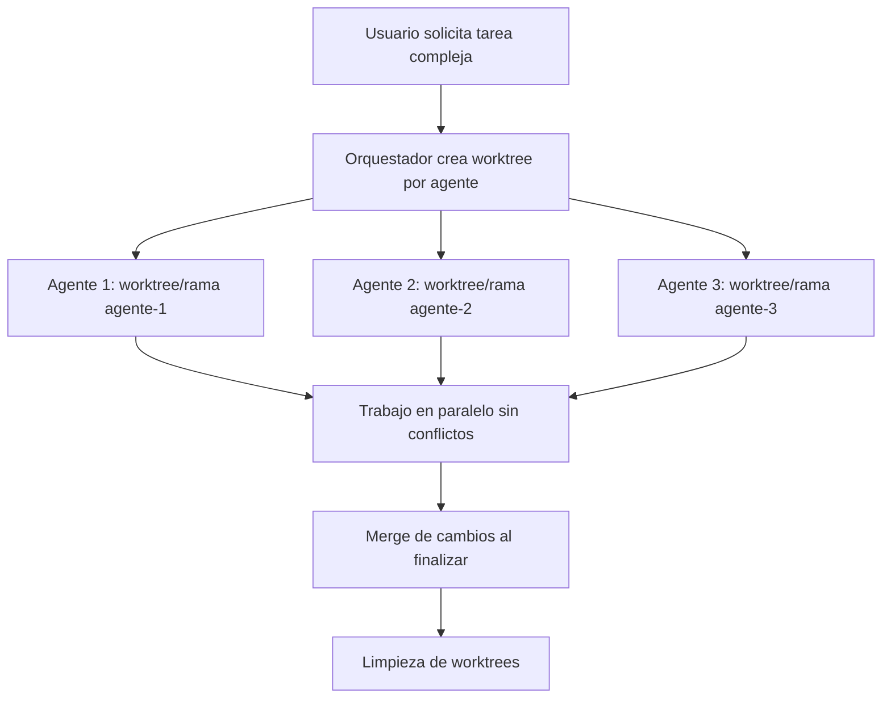

**Ventajas:**

- **Cero conflictos de merge** durante la ejecución paralela
- **Historial Git limpio** con ramas separadas por agente
- **Rollback sencillo** eliminando el worktree
- **Revisión independiente** del trabajo de cada agente

**Referencia verificada:** `JsonLee12138/agent-team` README, sección "Worker Operations".

---

### Sesiones Terminales Dedicadas por Agente

**Definición:**  
Cada agente ejecutándose en un worktree aislado tiene asignada su propia sesión de terminal independiente, gestionada mediante multiplexores de terminal como `wezterm` o `tmux`.

**Explicación contextualizada:**  
Las sesiones terminales dedicadas permiten que cada agente interactúe con su entorno de trabajo de forma aislada. El usuario puede cambiar entre sesiones para monitorizar el progreso de diferentes agentes o intervenir cuando sea necesario.

**Configuración típica:**

| Variable de Entorno | Valor por Defecto | Descripción |
|---------------------|-------------------|-------------|
| `AGENT_TEAM_BACKEND` | `wezterm` | Multiplexor de terminal: `wezterm` o `tmux` |

**Ejemplo de uso:**
```bash
# Abrir sesión de un worker específico
agent-team worker open frontend-architect-001 --new-window

# El agente se ejecuta en una ventana/pestaña separada
# El usuario puede alternar entre sesiones con atajos de teclado
```

**Referencia verificada:** `JsonLee12138/agent-team` README, sección "Environment Variables".

---

## 2. Coordinación de Agentes

### Múltiples Agentes en Paralelo

**Definición:**  
Capacidad de ejecutar simultáneamente varios agentes de IA, cada uno con una tarea específica, coordinados por un agente líder o sistema de orquestación.

**Explicación contextualizada:**  
En lugar de tener un único agente secuencial realizando todas las tareas, la ejecución paralela permite dividir trabajo complejo en subtareas asignadas a diferentes agentes que trabajan concurrentemente. Esto reduce significativamente el tiempo total de ejecución.

**Arquitectura de ejecución paralela:**

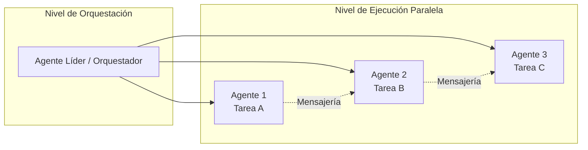

**Implementaciones verificadas:**

| Proyecto | Enfoque | Características distintivas |
|----------|---------|----------------------------|
| `hueyexe/opencode-ensemble` | Plugin de OpenCode | Dashboard web, mensajería peer-to-peer, tasks con dependencias |
| `JsonLee12138/agent-team` | CLI + worktrees | Aislamiento total por worktree, sesiones terminales dedicadas |
| `0xSero/orchestra` | Plugin hub-and-spoke | 6 workers especializados, memory opcional con Neo4j |

**Ejemplo práctico:**
```
Usuario: "Añade validación de entrada a todos los endpoints API y escribe tests"

Orquestador:
1. Crea equipo "validacion"
2. Spawnea 3 agentes en paralelo:
   - alice: valida endpoints de usuario (POST /users, PUT /users/:id)
   - bob: valida endpoints de pedido (POST /orders, PUT /orders/:id)
   - carol: escribe tests de integración para todos los endpoints validados
3. carol espera a que alice y bob terminen (dependencia)
```

**Referencia verificada:** `hueyexe/opencode-ensemble` README, sección "What actually happens".

---

### Mensajería, Tareas Compartidas y Coordinación entre Agentes

**Definición:**  
Sistema de comunicación bidireccional entre agentes que incluye mensajería directa (peer-to-peer), difusión (broadcast) y un tablero compartido de tareas con dependencias.

**Explicación contextualizada:**  
La coordinación efectiva entre agentes requiere mecanismos de comunicación estructurados. Los agentes pueden enviarse mensajes directos para coordinar trabajo dependiente, anunciar completitud de tareas, o solicitar información. El tablero de tareas compartido proporciona visibilidad del estado global del trabajo.

**Tipos de comunicación:**

| Tipo | Descripción | Ejemplo de uso |
|------|-------------|----------------|
| **Mensaje directo** | Agente → Agente específico | `alice -> bob: "¿Manejaste validación de email?"` |
| **Mensaje al líder** | Agente → Orquestador | `bob -> lead: "Validación completada"` |
| **Broadcast** | Agente → Todos | `lead -> all: "Pausa para revisión"` |
| **Tablero de tareas** | Estado compartido | `task: "Validar POST /users" [COMPLETED]` |

**Herramientas de coordinación (opencode-ensemble):**

| Herramienta | Propósito | Disponible para |
|-------------|-----------|-----------------|
| `team_message` | Enviar mensaje directo | Todos los agentes |
| `team_broadcast` | Mensaje a todo el equipo | Todos los agentes |
| `team_tasks_add` | Añadir tareas al tablero | Todos los agentes |
| `team_tasks_complete` | Marcar tarea completada | Todos los agentes |
| `team_tasks_list` | Listar tareas con estado | Todos los agentes |
| `team_claim` | Reclamar tarea pendiente | Todos los agentes |
| `team_status` | Ver estado del equipo | Solo líder |
| `team_spawn` | Crear nuevo agente | Solo líder |
| `team_shutdown` | Detener agente | Solo líder |

**Ejemplo de flujo de mensajería:**
```
alice -> lead: "Validación de usuario completada. Añadidos schemas zod."
bob -> lead: "Validación de pedidos completada. Encontrado edge case."
bob -> alice: "¿Manejaste validación de formato de email?"
alice -> bob: "Sí, usando z.string().email(). Ver src/validators/user.ts línea 12."
```

**Referencia verificada:** `hueyexe/opencode-ensemble` README, secciones "Tools" y "What you see in the TUI".

---

### Sesión Independiente y Ventana de Contexto por Agente

**Definición:**  
Cada agente ejecutándose en paralelo tiene su propia sesión de OpenCode independiente con una ventana de contexto fresca y aislada de otros agentes.

**Explicación contextualizada:**  
Las ventanas de contexto de los LLM tienen límites de tokens. Al asignar una sesión independiente por agente, se evita que el contexto se llene con información irrelevante de otras tareas. Cada agente mantiene únicamente el contexto necesario para su tarea específica.

**Beneficios del aislamiento de contexto:**

| Beneficio | Impacto |
|-----------|---------|
| **Contexto limpio** | Cada agente solo ve información relevante a su tarea |
| **Sin contaminación** | El trabajo de un agente no afecta el contexto de otro |
| **Compaction safety** | El contexto del equipo se preserva durante compactación |
| **Sub-agente aislamiento** | Sub-agentes no pueden usar herramientas del equipo padre |

**Arquitectura de sesiones:**

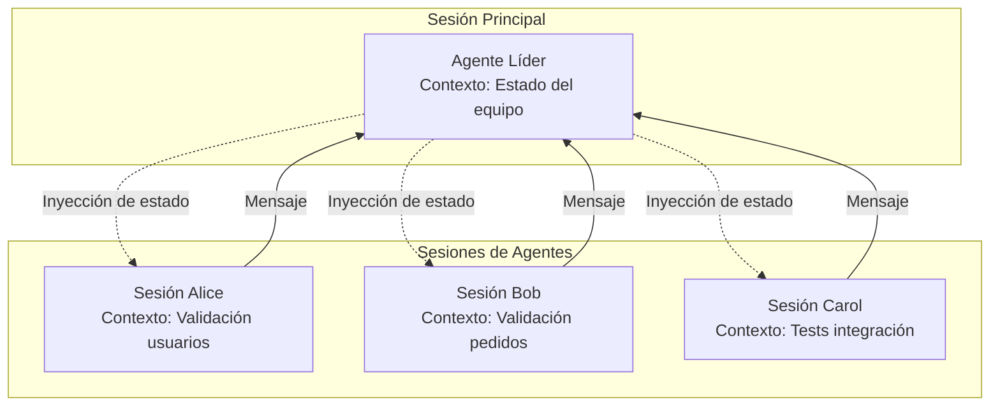

**Mecanismo de inyección de contexto:**  
El prompt del sistema del agente líder incluye el estado del equipo (estado de miembros, conteo de tareas) en cada llamada al LLM. Los agentes reciben un recordatorio breve de su rol.

**Referencia verificada:** `hueyexe/opencode-ensemble` README, secciones "Architecture" y "Compaction safety".

---

### Modelo Arquitectónico Role + Worker

**Definición:**  
Patrón arquitectónico donde los **Roles** son paquetes de habilidades reutilizables que definen objetivos, prompts y herramientas, y los **Workers** son instancias de ejecución aisladas con su propia rama Git y sesión terminal.

**Explicación contextualizada:**  
Implementado por `JsonLee12138/agent-team`, este modelo separa la definición de capacidades (Role) de la ejecución concreta (Worker). Un Role puede instanciarse múltiples veces como Workers diferentes, cada uno trabajando en una tarea específica.

**Componentes del modelo:**

| Componente | Ubicación | Propósito |
|------------|-----------|-----------|
| **Role** | `.agent-team/teams/` | Paquete de habilidades reutilizable con goals, prompts y tools |
| **Worker** | `.worktrees/` | Instancia de runtime aislada con su propia rama y sesión |
| **Task** | `.agent-team/task/<task-id>/` | Paquete de tarea con metadata, contexto y verificación |

**Relación Role-Worker:**

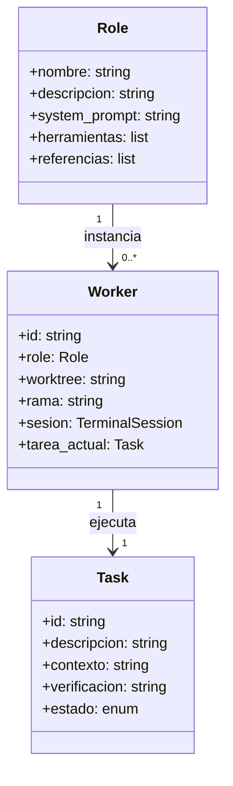

**Roles incorporados:**

| Role | Propósito |
|------|-----------|
| `pm` | Product Manager y definición de requisitos |
| `frontend-architect` | Estructura UI/UX de alto nivel |
| `vite-react-dev` | Especializado en Vite + React |
| `pencil-designer` | Especialista en herramientas de diseño UI |

**Ciclo de vida de un Worker:**
1. Crear Worker desde un Role: `agent-team worker create frontend-architect`
2. Asignar tarea: `agent-team worker assign frontend-architect-001 "Diseñar flujo auth"`
3. Ejecutar en sesión aislada: `agent-team worker open frontend-architect-001`
4. Brainstorming y planificación (validado antes de implementar)
5. Implementación en worktree aislado
6. Merge de cambios: `agent-team worker merge frontend-architect-001`
7. Limpieza: `agent-team worker delete frontend-architect-001`

**Referencia verificada:** `JsonLee12138/agent-team` README, secciones "The Toolkit" y "Directory Structure".

---

### Role-Hub para Gestión de Roles Remotos

**Definición:**  
Sistema centralizado para descubrir, instalar y gestionar Roles remotos desde repositorios GitHub, permitiendo compartir y reutilizar definiciones de agentes entre proyectos.

**Explicación contextualizada:**  
El Role-Hub funciona como un registry de Roles que los equipos pueden compartir. En lugar de definir Roles desde cero para cada proyecto, se pueden instalar Roles curados desde repositorios remotos.

**Comandos de gestión:**

| Comando | Propósito |
|---------|-----------|
| `agent-team role-repo add <owner/repo>` | Instalar Roles desde un repositorio GitHub |
| `agent-team role list` | Listar Roles locales disponibles |
| `agent-team role create <name>` | Crear nuevo paquete de Role |

**Flujo de instalación de Roles remotos:**


**Estructura de un Role:**
```
.agent-team/teams/frontend-architect/
├── SKILL.md           # Definición de habilidades
├── references/
│   └── role.yaml      # Metadata del role
└── system.md          # Prompt del sistema específico
```

**Variable de entorno para telemetría:**
| Variable | Por Defecto | Descripción |
|----------|-------------|-------------|
| `AGENT_TEAM_ROLE_HUB_URL` | `https://...` | Endpoint para ingesta de analytics |
| `AGENT_TEAM_ROLE_HUB_DEBUG` | `0` | Si es `1`, espera confirmación de ingesta |

**Referencia verificada:** `JsonLee12138/agent-team` README, secciones "Role Management" y "Environment Variables".

---

## 3. Herramientas y Extensiones

### Bundle de Componentes

**Definición:**  
Paquete pre-empaquetado que incluye múltiples componentes de OpenCode (plugins, agentes, skills, MCP servers, commands) configurados para funcionar conjuntamente.

**Explicación contextualizada:**  
Los bundles simplifican la configuración inicial proporcionando un conjunto coherente de herramientas pre-configuradas. En lugar de instalar y configurar cada componente individualmente, el bundle proporciona una instalación unificada.

**Ejemplo verificado: `kdcokenny/opencode-workspace`**

| Tipo de Componente | Cantidad | Ejemplos |
|--------------------|----------|----------|
| **Plugins** | 4 | devcontainers, background-agents, notify, worktree |
| **npm Plugins** | 2 | DCP (Developer Context Protocol), otros |
| **MCP Servers** | 3 | Servidores de contexto y herramientas |
| **Agentes** | 4 | researcher, coder, scribe, reviewer |
| **Skills** | 4 | Filosofía de código, patrones de desarrollo |
| **Commands** | 1 | Comandos personalizados |

**Ventajas de los bundles:**

| Ventaja | Descripción |
|---------|-------------|
| **Instalación simplificada** | Un solo comando instala todos los componentes |
| **Configuración coherente** | Todos los componentes están probados para trabajar juntos |
| **Perfiles preconfigurados** | Modos de trabajo listos para usar |
| **Ahorro de tiempo** | Elimina configuración manual inicial |

**Ejemplo de instalación:**
```json
// opencode.json
{
  "plugin": ["opencode-workspace"]
}
```

**Referencia verificada:** Análisis de repositorios en `temp/00 analisis-repositorios-opencode.md`, entrada `kdcokenny/opencode-workspace`.

---

### Plugins Genéricos

**Definición:**  
Módulos de JavaScript/TypeScript que se enganchan a eventos del ciclo de vida de OpenCode para extender o modificar su comportamiento.

**Explicación contextualizada:**  
Los plugins genéricos son desarrollados por la comunidad y pueden interceptar cualquier evento del sistema: ejecución de herramientas, edición de archivos, creación de sesiones, permisos, etc. Se cargan desde directorios locales o npm.

**Ubicaciones de carga:**

| Ubicación | Alcance |
|-----------|---------|
| `.opencode/plugins/` | Plugins del proyecto |
| `~/.config/opencode/plugins/` | Plugins globales |

**Estructura básica de un plugin:**
```javascript
// .opencode/plugins/example.js
export const MyPlugin = async ({ project, client, $, directory, worktree }) => {
  console.log("Plugin initialized!")
  
  return {
    // Hooks van aquí
    "tool.execute.before": async (input, output) => {
      // Modificar antes de ejecutar herramienta
    },
    "file.edited": async (event) => {
      // Reaccionar a edición de archivo
    }
  }
}
```

**Eventos disponibles:**

| Categoría | Eventos |
|-----------|---------|
| **Command** | `command.executed` |
| **File** | `file.edited`, `file.watcher.updated` |
| **Message** | `message.updated`, `message.removed`, `message.part.updated` |
| **Permission** | `permission.asked`, `permission.replied` |
| **Session** | `session.created`, `session.compacted`, `session.deleted` |
| **Tool** | `tool.execute.before`, `tool.execute.after` |
| **TUI** | `tui.prompt.append`, `tui.command.execute`, `tui.toast.show` |

**Ejemplos de uso:**

| Plugin | Propósito |
|--------|-----------|
| **Notificación** | Enviar notificaciones del sistema al completar sesiones |
| **Protección .env** | Prevenir lectura de archivos `.env` |
| **Inyección de entorno** | Inyectar variables de entorno en todas las ejecuciones shell |
| **Herramientas custom** | Añadir herramientas personalizadas |
| **Logging estructurado** | Usar `client.app.log()` en lugar de `console.log` |
| **Compaction hooks** | Personalizar contexto incluido durante compactación |

**Ejemplo: Protección de .env**
```javascript
// .opencode/plugins/env-protection.js
export const EnvProtection = async ({ project, client, $, directory, worktree }) => {
  return {
    "tool.execute.before": async (input, output) => {
      if (input.tool === "read" && output.args.filePath.includes(".env")) {
        throw new Error("Do not read .env files")
      }
    }
  }
}
```

**Referencia verificada:** Documentación oficial OpenCode, `/docs/plugins`.

---

### Plugins de npm

**Definición:**  
Plugins de OpenCode distribuidos como paquetes npm, instalados automáticamente desde el registry de npm al especificarlos en la configuración.

**Explicación contextualizada:**  
Los plugins de npm permiten distribuir extensiones de OpenCode como paquetes versionados. OpenCode los instala automáticamente al inicio usando Bun, cacheándolos en `~/.cache/opencode/node_modules/`.

**Configuración:**
```json
// opencode.json
{
  "$schema": "https://opencode.ai/config.json",
  "plugin": [
    "opencode-helicone-session",
    "opencode-wakatime",
    "@hueyexe/opencode-ensemble@0.13.3",
    "@my-org/custom-plugin"
  ]
}
```

**Características:**

| Característica | Descripción |
|----------------|-------------|
| **Instalación automática** | Se instalan al inicio de OpenCode |
| **Cache** | Paquetes cacheados en `~/.cache/opencode/node_modules/` |
| **Versionado** | Soporta versiones específicas y scoped packages |
| **Dependencias** | Las dependencias del plugin se instalan automáticamente |

**Orden de carga:**
1. Configuración global (`~/.config/opencode/opencode.json`)
2. Configuración del proyecto (`opencode.json`)
3. Directorio global de plugins (`~/.config/opencode/plugins/`)
4. Directorio del proyecto (`.opencode/plugins/`)

**Nota importante sobre versionado:**  
OpenCode tiene un bug conocido donde plugins sin versión específica (ej. `"@hueyexe/opencode-ensemble"`) se cachean en la primera instalación y nunca se actualizan automáticamente. **Se recomienda fijar versiones explícitas** (ej. `"@hueyexe/opencode-ensemble@0.13.3"`).

**Ejemplos de plugins npm populares:**

| Plugin | Propósito | Stars |
|--------|-----------|-------|
| `@hueyexe/opencode-ensemble` | Equipos de agentes en paralelo | 73 |
| `opencode-wakatime` | Tracking de tiempo con WakaTime | - |
| `opencode-helicone-session` | Logging de sesiones con Helicone | - |

**Referencia verificada:** Documentación oficial OpenCode, `/docs/plugins`.

---

### Servidores MCP (Model Context Protocol)

**Definición:**  
El Model Context Protocol (MCP) es un estándar para conectar herramientas y datos externos a agentes de IA. Los servidores MCP exponen herramientas que OpenCode puede usar junto con sus herramientas built-in.

**Explicación contextualizada:**  
MCP permite extender las capacidades de OpenCode conectándolo a servicios externos (Sentry, GitHub, bases de datos, APIs) de forma estandarizada. Los servidores MCP pueden ser locales (ejecutados como comandos) o remotos (accedidos vía HTTP).

**Tipos de servidores MCP:**

| Tipo | Configuración | Caso de uso |
|------|---------------|-------------|
| **Local** | `type: "local"`, `command: ["npx", "-y", "mi-comando"]` | Herramientas ejecutadas localmente |
| **Remoto** | `type: "remote"`, `url: "https://servidor.com"` | Servicios en la nube |
| **Remoto con OAuth** | `type: "remote"`, `oauth: {...}` | Servicios que requieren autenticación |

**Configuración de ejemplo:**
```json
// opencode.json
{
  "$schema": "https://opencode.ai/config.json",
  "mcp": {
    "sentry": {
      "type": "remote",
      "url": "https://mcp.sentry.dev/mcp",
      "oauth": {}
    },
    "context7": {
      "type": "remote",
      "url": "https://mcp.context7.com/mcp",
      "headers": {
        "CONTEXT7_API_KEY": "{env:CONTEXT7_API_KEY}"
      }
    },
    "mcp_everything": {
      "type": "local",
      "command": ["npx", "-y", "@modelcontextprotocol/server-everything"]
    }
  }
}
```

**Herramientas MCP populares:**

| Servidor | Propósito | Configuración |
|----------|-----------|---------------|
| **Sentry** | Interactuar con issues y proyectos de Sentry | `opencode mcp auth sentry` |
| **Context7** | Búsqueda en documentación de librerías | Añadir `use context7` al prompt |
| **Grep by Vercel** | Buscar snippets de código en GitHub | Añadir `use the gh_grep tool` al prompt |

**Gestión de autenticación OAuth:**
```bash
# Autenticar con un servidor MCP
opencode mcp auth sentry

# Listar servidores y estado de autenticación
opencode mcp list

# Eliminar credenciales almacenadas
opencode mcp logout sentry

# Debug de conexión y flujo OAuth
opencode mcp debug my-oauth-server
```

**Advertencia importante:**  
Los servidores MCP añaden tokens al contexto. Servidores con muchas herramientas (como GitHub MCP) pueden exceder rápidamente el límite de contexto. **Se recomienda habilitar solo los servidores necesarios.**

**Gestión por agente:**
```json
{
  "mcp": {
    "my-mcp": {
      "type": "local",
      "command": ["bun", "x", "my-mcp-command"],
      "enabled": true
    }
  },
  "tools": {
    "my-mcp*": false
  },
  "agent": {
    "mi-agente": {
      "tools": {
        "my-mcp*": true
      }
    }
  }
}
```

**Referencia verificada:** Documentación oficial OpenCode, `/docs/mcp-servers`.

---

### Jester (Definición y Propósito)

**Definición:**  
Agente especializado que actúa como "truth-teller" (decidor de verdades), diseñado para cuestionar suposiciones, encontrar puntos ciegos y proporcionar análisis adversarial en cambios riesgosos.

**Explicación contextualizada:**  
Parte del patrón de orquestación `wildwasser/opencode-agents`, Jester se invoca específicamente para cambios complejos o riesgosos. Opera a alta temperatura (0.8) intencionalmente para generar perspectivas diversas y desafiar el pensamiento grupal.

**Características del agente Jester:**

| Característica | Valor | Propósito |
|----------------|-------|-----------|
| **Temperatura** | 0.8 | Generar perspectivas diversas, actuar como wildcard |
| **Rol** | Truth-Teller | Cuestionar suposiciones, encontrar puntos ciegos |
| **Cuándo invocar** | Cambios riesgosos | Refactorizaciones complejas, decisiones arquitectónicas |

**Cuándo llamar a Jester:**

| Situación | Razón |
|-----------|-------|
| **Refactorizaciones complejas** | Tocar más de 5 archivos |
| **Cambios arquitectónicos riesgosos** | Modificar abstracciones core |
| **El equipo está atascado** | Romper círculos de pensamiento |
| **Un plan parece "correcto" pero muerto** | Encontrar problemas ocultos |
| **Todos están de acuerdo demasiado rápido** | ¡Peligro de pensamiento grupal! |

**Patrón de delegación:**
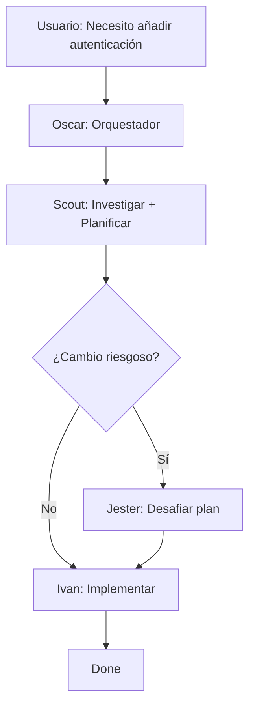

**Filosofía de Jester:**  
> "La mayoría de lo que Jester dice es ruido, pero enterrado ahí hay insight dorado. Busca oro."

**Referencia verificada:** `wildwasser/opencode-agents` README, secciones "The Agents" y "When to Call Jester".

---

### Jester con Variantes de Modelo (Opus, Qwen, Grok)

**Definición:**  
Múltiples instancias del agente Jester, cada una ejecutándose sobre un modelo de LLM diferente (Claude Opus, Qwen Coder, Grok), proporcionando perspectivas diversas desde diferentes arquitecturas de IA.

**Explicación contextualizada:**  
Diferentes modelos de IA tienen diferentes fortalezas y puntos ciegos debido a sus datos de entrenamiento y arquitecturas. Ejecutar múltiples variantes de Jester en paralelo para decisiones críticas proporciona diversidad de perspectivas.

**Variantes de Jester:**

| Variante | Modelo | Caso de Uso |
|----------|--------|-------------|
| **jester** / **jester_opus** | Claude Opus | Truth-teller por defecto, razonamiento fuerte |
| **jester_qwen** | Qwen3 Coder 480B | Análisis enfocado en código |
| **jester_grok** | Grok | Perspectiva alternativa, datos de entrenamiento diferentes |

**Patrón de Consenso Jester:**

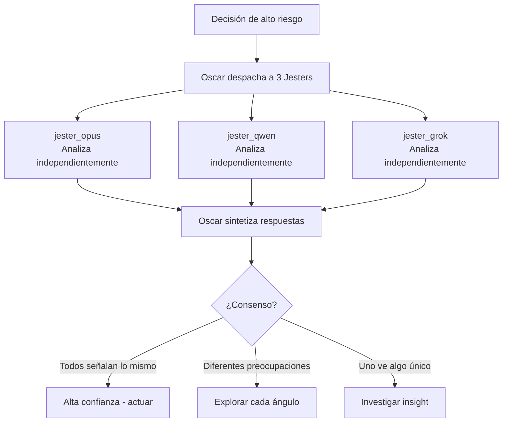

**Cuándo usar Jester Consensus:**

| Situación | Justificación |
|-----------|---------------|
| **Decisiones arquitectónicas mayores** | Cambiar abstracciones core, añadir nuevos patrones |
| **Refactorizaciones riesgosas** | Cambios que tocan más de 5 archivos o paths críticos |
| **Perspectivas diversas necesarias** | Cuando se quieren múltiples viewpoints de IA |
| **Romper empates** | Cuando el equipo está atascado o en círculos |

**Configuración de modelos:**
```json
{
  "agent": {
    "jester": {
      "model": "zen/claude-opus-4-5",
      "temperature": 0.8
    },
    "jester_opus": {
      "model": "zen/claude-opus-4-5",
      "temperature": 0.8
    },
    "jester_qwen": {
      "model": "zen/qwen3-coder-480b",
      "temperature": 0.8
    },
    "jester_grok": {
      "model": "zen/grok-3",
      "temperature": 0.8
    }
  }
}
```

**Por qué múltiples modelos:**

| Modelo | Fortalezas | Detecta mejor |
|--------|------------|---------------|
| **Claude Opus** | Razonamiento fuerte | Flaws lógicos, inconsistencias |
| **Qwen3 Coder** | Enfocado en código | Problemas de implementación |
| **Grok** | Perspectiva alternativa | Ángulos no considerados |

**Referencia verificada:** `wildwasser/opencode-agents` README, secciones "Jester Variants" y "Jester Consensus Pattern".

---

## 4. Configuración y Orquestación

### Configuraciones de Orquestador (Orchestrator Configs)

**Definición:**  
Archivos de configuración que definen el comportamiento de agentes orquestadores, incluyendo modelos, permisos, prompts del sistema y herramientas disponibles.

**Explicación contextualizada:**  
Las configuraciones de orquestador determinan cómo un agente coordina el trabajo de otros agentes. Se definen en `opencode.json` (formato JSON) o en archivos `.md` dentro de `.opencode/agents/`.

**Opciones de configuración:**

| Opción | Tipo | Descripción |
|--------|------|-------------|
| `description` | string | Descripción del propósito del agente (requerido) |
| `mode` | enum | `primary`, `subagent`, o `all` |
| `model` | string | Override del modelo (ej. `anthropic/claude-sonnet-4-20250514`) |
| `temperature` | float | Controla aleatoriedad (0.0-1.0) |
| `steps` | int | Máximo de iteraciones agénticas |
| `prompt` | string | Ruta a archivo de prompt personalizado |
| `permission` | object | Permisos para herramientas |
| `permission.task` | object | Controla qué sub-agentes puede invocar |
| `color` | string | Color en la UI (hex o nombre de tema) |
| `hidden` | boolean | Ocultar de autocomplete `@` |

**Ejemplo de configuración JSON:**
```json
{
  "$schema": "https://opencode.ai/config.json",
  "agent": {
    "orchestrator": {
      "description": "Coordina y delega trabajo a agentes especializados",
      "mode": "primary",
      "model": "anthropic/claude-sonnet-4-20250514",
      "temperature": 0.3,
      "prompt": "{file:./prompts/orchestrator.txt}",
      "permission": {
        "edit": "ask",
        "bash": "ask",
        "task": {
          "*": "deny",
          "orchestrator-*": "allow",
          "code-reviewer": "ask"
        }
      },
      "color": "#FF5733"
    }
  }
}
```

**Ejemplo de configuración Markdown:**
```markdown
---
description: Coordina y delega trabajo a agentes especializados
mode: primary
model: anthropic/claude-sonnet-4-20250514
temperature: 0.3
permission:
  edit: ask
  bash: ask
  task:
    "*": deny
    "orchestrator-*": allow
---

Eres un orquestador. Tu trabajo es coordinar y delegar, no hacer el trabajo directamente.

Reglas:
1. Nunca leas archivos o escribas código directamente
2. Delega investigación a Scout
3. Delega implementación a Ivan
4. Llama a Jester para cambios riesgosos (>5 archivos)
```

**Jerarquía de configuración:**

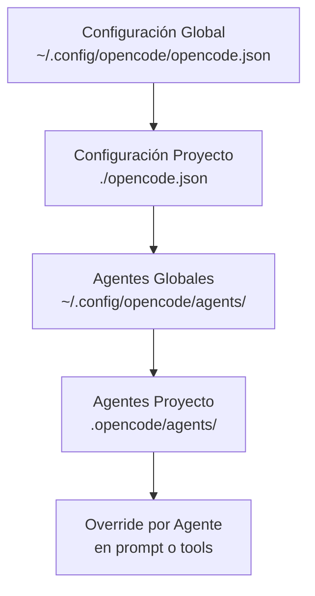

**Patrones de permisos:**

| Patrón | Ejemplo | Resultado |
|--------|---------|-----------|
| **Shorthand** | `"edit": "allow"` | Permitir todas las operaciones de edición |
| **Glob pattern** | `"bash": {"git *": "ask"}` | Pedir permiso para comandos git |
| **Wildcard específico** | `"mymcp_*": "deny"` | Denegar todas las herramientas de un MCP |
| **Task permissions** | `"task": {"review-*": "allow"}` | Solo permitir invocar sub-agentes de review |

**Referencia verificada:** Documentación oficial OpenCode, `/docs/agents`.

---

### Flujo de Trabajo de Orquestación Estructurada

**Definición:**  
Proceso sistemático para resolver issues o implementar features mediante planificación y ejecución colaborativa entre múltiples agentes especializados.

**Explicación contextualizada:**  
Implementado por proyectos como `agents-to-go/opencode-orch-mode`, este flujo estructura el trabajo en fases claras: issue → plan → ejecución → review → loop de calidad hasta alcanzar umbral de compliance.

**Fases del flujo:**

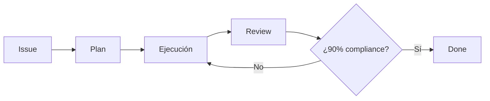

**Detalle de cada fase:**

| Fase | Responsable | Entregable |
|------|-------------|------------|
| **Issue** | Usuario / Orquestador | Descripción del problema o feature |
| **Plan** | Scout / Planner | Roadmap, milestones, phases, tasks |
| **Ejecución** | Ivan / Worker | Código implementado, tests |
| **Review** | Reviewer / QA | Revisión de código, validación |
| **QA Loop** | Todos | Iteraciones hasta 90% compliance |

**Artefactos de planificación:**

| Artefacto | Ubicación | Propósito |
|-----------|-----------|-----------|
| **Roadmap** | `.agent-team/planning/roadmaps/` | Visión de alto nivel, objetivos a largo plazo |
| **Milestone** | `.agent-team/planning/milestones/` | Hitos intermedios con criterios de aceptación |
| **Phase** | `.agent-team/planning/phases/` | Fases específicas dentro de un milestone |
| **Task** | `.agent-team/task/<task-id>/` | Unidad de trabajo ejecutable |

**Estructura de un paquete de tarea:**
```
.agent-team/task/task-001/
├── task.yaml          # Metadata del ciclo de vida y estado
├── context.md         # Background, scope, constraints, design input
└── verification.md    # Contrato de aceptación, tests, resultado final
```

**Comandos de gestión:**

| Comando | Propósito |
|---------|-----------|
| `agent-team planning create --kind <roadmap\|milestone\|phase> "<title>"` | Crear artefacto de planificación |
| `agent-team planning list [--kind <kind>]` | Listar artefactos de planificación |
| `agent-team planning show <id>` | Mostrar artefacto y verificaciones |
| `agent-team planning move <id> --to <planning\|archived\|deprecated>` | Mover entre ciclos de vida |
| `agent-team task create` | Crear tarea con verification.md automático |
| `agent-team task done` | Mover tarea a estado `verifying` |
| `agent-team task archive` | Archivar tarea (solo si verification.md pasa) |

**Umbral de calidad:**  
El flujo requiere **90% de compliance** antes de considerar el trabajo completado. Esto se verifica mediante:
- Tests pasando
- Linters sin errores
- Revisión de código aprobada
- verification.md con resultado positivo

**Referencia verificada:** `JsonLee12138/agent-team` README (secciones "Planning Artifacts", "Task Artifacts") y `agents-to-go/opencode-orch-mode` (mencionado en análisis de repositorios).

---

## 5. Flujos de Trabajo y Calidad

### Proceso de Brainstorming Validado antes de la Implementación

**Definición:**  
Skill que valida ideas mediante diálogo antes de implementar, incluyendo selección de objetivo de planificación y elección explícita de destino de guardado.

**Explicación contextualizada:**  
Implementado en `JsonLee12138/agent-team`, este proceso asegura que las ideas se validen y estructuren antes de escribir código. Previene implementación prematura y asegura alineación con objetivos del proyecto.

**Opciones de destino de planificación:**

| Tipo | Descripción |
|------|-------------|
| **roadmap** | Visión de alto nivel, objetivos estratégicos |
| **milestone** | Hitos intermedios con criterios claros |
| **phase** | Fases específicas dentro de un milestone |
| **task** | Unidad de trabajo ejecutable |
| **generic topic** | Tema genérico sin estructura formal |

**Opciones de destino de guardado:**

| Destino | Descripción |
|---------|-------------|
| `docs/brainstorming/` | Directorio general para brainstorming |
| Directorio del objeto objetivo | Guardar junto al artefacto relacionado |
| Ruta personalizada | Especificar ruta explícita |
| Skip saving | No guardar, solo discusión |

**Flujo del proceso:**

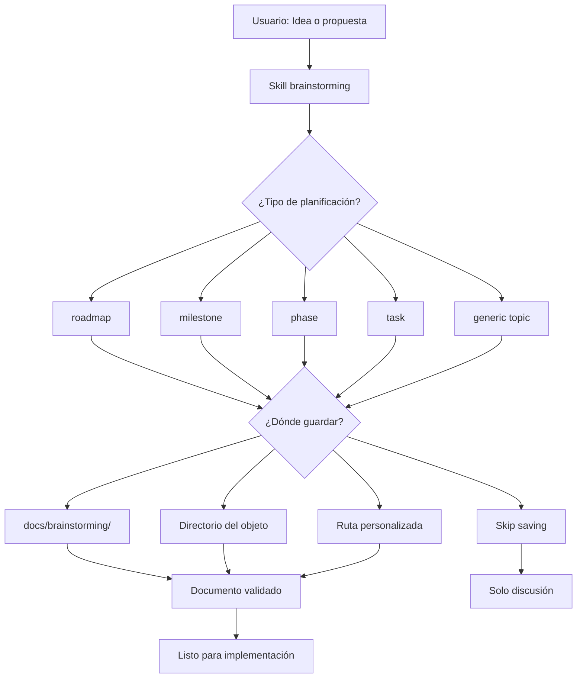

**Ejemplo de uso:**
```
Usuario: "Deberíamos añadir autenticación OAuth2"

Agente (brainstorming skill):
1. "¿Qué tipo de planificación es esta?"
   - roadmap, milestone, phase, task, o generic topic
   
2. Usuario: "milestone"

3. "¿Dónde quieres guardar el brainstorming?"
   - docs/brainstorming/
   - docs/auth/ (directorio del objeto)
   - Ruta personalizada
   - Skip saving

4. Usuario: "docs/auth/"

5. Agente genera documento de brainstorming con:
   - Contexto y justificación
   - Opciones consideradas
   - Recomendación
   - Criterios de aceptación
   
6. Documento se guarda en docs/auth/brainstorming-oauth2.md

7. Una vez validado, se procede a crear tasks de implementación
```

**Beneficios:**
- **Previene implementación prematura**
- **Documenta razonamiento detrás de decisiones**
- **Permite revisión antes de commit de tiempo**
- **Crea trazabilidad de decisiones de diseño**

**Referencia verificada:** `JsonLee12138/agent-team` README, sección "Built-in Skills" (skill: `brainstorming`).

---

### Bucle de Control de Calidad (QA Loop)

**Definición:**  
Proceso iterativo de revisión y corrección que continúa hasta alcanzar un umbral de calidad definido (típicamente 90% de compliance).

**Explicación contextualizada:**  
El QA loop es un mecanismo de garantía de calidad donde el trabajo se revisa, se identifican problemas, se corrigen, y se vuelve a revisar hasta alcanzar el umbral acordado. Implementado en flujos como `agents-to-go/opencode-orch-mode`.

**Componentes del QA Loop:**

| Componente | Descripción |
|------------|-------------|
| **Umbral de compliance** | Típicamente 90% de tests/criterios pasando |
| **Checklist de verificación** | Lista de criterios a validar |
| **Iteración** | Ciclos de corrección hasta alcanzar umbral |
| **Documentación** | verification.md registra resultados |

**Flujo del QA Loop:**

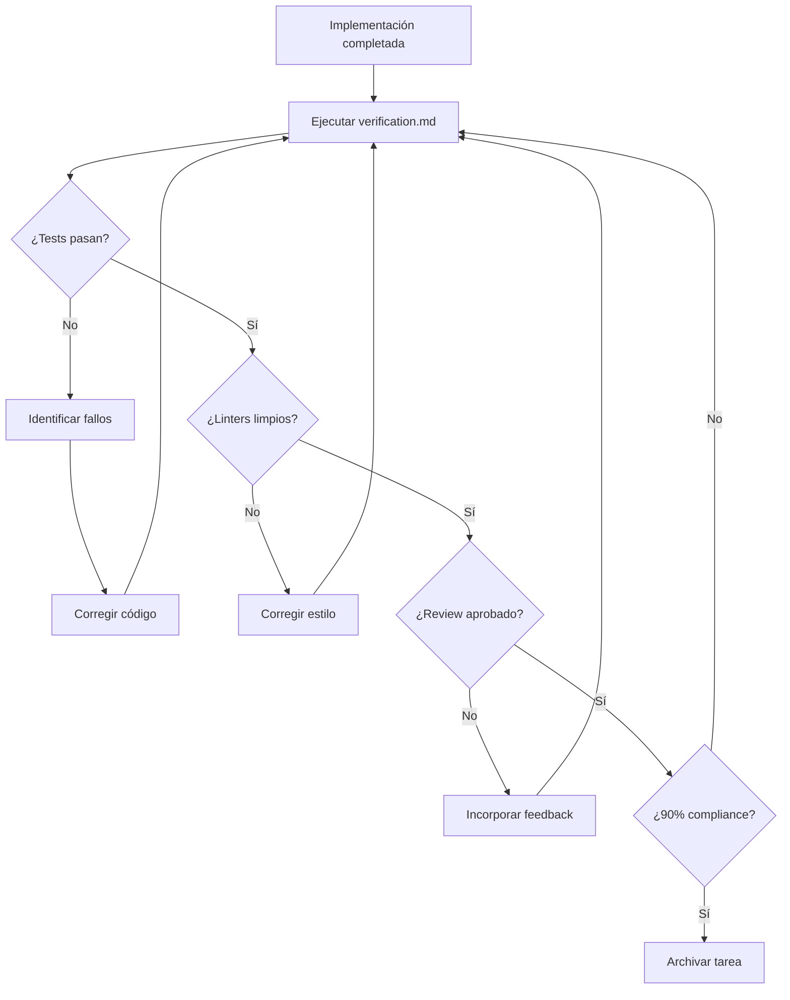

**Estructura de verification.md:**
```markdown
# Verification Report

## E2E Required: no
## Verified By: qa
## Result: pending

## Checks Performed

### Tests
- [ ] Unit tests passing
- [ ] Integration tests passing
- [ ] E2E tests passing

### Code Quality
- [ ] Linter passing
- [ ] Type checking passing
- [ ] No security vulnerabilities

### Documentation
- [ ] README updated
- [ ] API docs updated
- [ ] Changelog updated

## Final Result

**Status:** PENDING
**Compliance:** 0/0 (0%)
```

**Actualización automática:**  
El archivo `verification.md` se actualiza automáticamente durante el QA loop:
- `task done` mueve la tarea a estado `verifying`
- `task archive` solo archiva si `verification.md` tiene resultado positivo
- `task deprecated` mueve trabajo incompleto o abandonado

**Herramientas de inspección:**

| Herramienta | Propósito |
|-------------|-----------|
| `task-inspector` | Inspección de tareas solo lectura |
| `worker-inspector` | Estado de workers solo lectura |

**Referencia verificada:** `JsonLee12138/agent-team` README (sección "Task Artifacts") y `agents-to-go/opencode-orch-mode` (mencionado en análisis de repositorios como "QA loop con 90% threshold").

---

### Revisión de Código Asistida por IA

**Definición:**  
Proceso de revisión de código donde agentes de IA especializados analizan cambios propuestos buscando problemas de seguridad, rendimiento, mantenibilidad y mejores prácticas.

**Explicación contextualizada:**  
La revisión de código asistida por IA puede implementarse mediante agentes especializados (como `code-reviewer` o `review`) o mediante herramientas externas como `spencermarx/open-code-review`. Estos agentes tienen permisos de solo lectura y se enfocan en identificar problemas antes del merge.

**Agentes de revisión comunes:**

| Agente | Modelo | Permisos | Enfoque |
|--------|--------|----------|---------|
| **code-reviewer** | Claude Sonnet | `edit: deny` | Seguridad, rendimiento, mantenibilidad |
| **security-auditor** | Claude Sonnet | `edit: deny` | Vulnerabilidades, exposición de datos |
| **docs-writer** | Variable | `bash: deny` | Claridad, estructura, ejemplos |

**Configuración de agente reviewer:**
```markdown
---
description: Reviews code for quality and best practices
mode: subagent
model: anthropic/claude-sonnet-4-20250514
temperature: 0.1
permission:
  edit: deny
  bash: deny
---

Eres un reviewer de código. Enfócate en:
- Calidad de código y mejores prácticas
- Bugs potenciales y edge cases
- Implicaciones de rendimiento
- Consideraciones de seguridad

Proporciona feedback constructivo sin hacer cambios directos.
```

**Áreas de enfoque:**

| Área | Qué buscar |
|------|------------|
| **Seguridad** | Validación de input, autenticación, autorización, exposición de datos |
| **Rendimiento** | Consultas N+1, operaciones costosas, caching |
| **Mantenibilidad** | Nombres claros, funciones pequeñas, DRY |
| **Testing** | Cobertura de tests, edge cases, mocks apropiados |
| **Documentación** | Comentarios útiles, docs de API actualizadas |

**Flujo de revisión:**

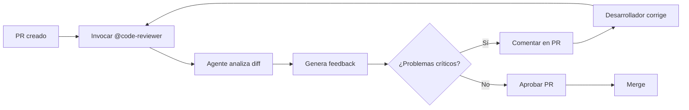

**Herramientas de revisión:**

| Herramienta | Propósito |
|-------------|-----------|
| `Read` | Leer archivos modificados |
| `Grep` | Buscar patrones en código |
| `Glob` | Encontrar archivos relacionados |
| `Bash` | Ejecutar tests, linters |
| `skill` | Cargar skills de review (ej. `python-code-review`) |

**Skills de revisión disponibles:**

| Skill | Descripción |
|-------|-------------|
| **python-code-review** | Checklist comprehensivo de review de Python |
| **pr-review** | Guidelines para feedback constructivo en PRs |
| **git-commit** | Convenciones de mensajes de commit |

**Ejemplo de uso:**
```
Usuario: "@code-reviewer revisa el PR #42 para el endpoint de usuarios"

Agente:
1. Lee archivos modificados
2. Ejecuta tests relacionados
3. Aplica checklist de python-code-review
4. Genera feedback estructurado:
   - ✅ Aspectos positivos
   - ⚠️ Problemas menores
   - 🚨 Problemas críticos
5. Sugiere correcciones específicas
```

**Herramienta externa: open-code-review**  
`spencermarx/open-code-review` proporciona un Command Center para lanzar revisiones de código, especificar targets y requisitos. (Nota: Solo mencionado en análisis de repositorios, no verificado directamente).

**Referencia verificada:** Documentación oficial OpenCode `/docs/agents` (ejemplos "Documentation agent" y "Security auditor"), `wildwasser/opencode-agents` (skills de review), y análisis de repositorios (`spencermarx/open-code-review`).

---

## 6. Sistemas de Control y Aprobación

### OpenAgentsControl (OAC)

**Definición:**  
Framework de agentes de IA para flujos de trabajo plan-first con ejecución basada en aprobación obligatoria. Multi-lenguaje (TypeScript, Python, Go, Rust, C#) con testing automático, code review y validación integrados.

**Explicación contextualizada:**  
Desarrollado por `darrenhinde/OpenAgentsControl` (3.9k stars, 315 forks), OAC se diferencia de otras soluciones por su enfoque en **CONTROL + REPETIBILIDAD** en lugar de velocidad y autonomía. Los agentes aprenden los patrones de codificación del usuario y generan código coincidente consistentemente.

**Características principales:**

| Característica | Descripción |
|----------------|-------------|
| **Aprobación obligatoria** | Los agentes SIEMPRE solicitan aprobación antes de ejecutar (no opcional) |
| **Sistema de contexto MVI** | Minimal Viable Information: 80% reducción de tokens |
| **ContextScout** | Descubrimiento inteligente de patrones antes de generar código |
| **Agentes editables** | Archivos markdown que puedes modificar directamente |
| **Multi-lenguaje** | TypeScript, Python, Go, Rust, C#, cualquier lenguaje |
| **Model-agnostic** | Claude, GPT, Gemini, MiniMax, modelos locales |
| **ExternalScout** | Obtiene documentación en vivo de librerías externas |

**Agentes principales:**

| Agente | Propósito | Caso de uso |
|--------|-----------|-------------|
| **OpenAgent** | Tareas generales, preguntas, aprendizaje | Usuarios principiantes, features simples |
| **OpenCoder** | Desarrollo production, features complejas | Código production, refactorización multi-archivo |
| **SystemBuilder** | Generar sistemas AI personalizados | Crear dominios AI específicos |

**Sub-agentes especializados:**

- **ContextScout** - Descubrimiento inteligente de patrones
- **TaskManager** - Divide features complejas en sub-tareas atómicas
- **CoderAgent** - Implementaciones de código enfocadas
- **TestEngineer** - Creación de tests y TDD
- **CodeReviewer** - Revisión de código y análisis de seguridad
- **BuildAgent** - Type checking y validación de build
- **DocWriter** - Generación de documentación
- **ExternalScout** - Obtiene docs en vivo de librerías externas

**Flujo de trabajo típico:**

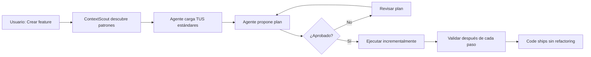

**Comandos de productividad:**

| Comando | Propósito |
|---------|-----------|
| `/add-context` | Wizard interactivo para añadir tus patrones |
| `/commit` | Commits de git inteligentes con formato convencional |
| `/test` | Workflows de testing |
| `/optimize` | Optimización de código |
| `/context` | Gestión de contexto |

**Referencia verificada:** `darrenhinde/OpenAgentsControl` README (3.9k stars, 215 commits, 9 releases).

---

### Puertas de Aprobación (Approval Gates)

**Definición:**  
Mecanismo de control que requiere aprobación humana explícita antes de que un agente pueda ejecutar acciones específicas (escribir archivos, ejecutar comandos bash, delegar a sub-agentes).

**Explicación contextualizada:**  
En OpenAgentsControl, las puertas de aprobación están **SIEMPRE activas** (no son opcionales). Esto contrasta con otras soluciones donde la aprobación es opcional o está desactivada por defecto.

**Acciones que requieren aprobación:**

| Acción | Requiere Aprobación | Justificación |
|--------|---------------------|---------------|
| Escribir/editar archivos | ✅ SIEMPRE | Prevenir cambios no deseados |
| Ejecutar comandos bash | ✅ SIEMPRE | Prevenir comandos peligrosos |
| Delegar a sub-agentes | ✅ SIEMPRE | Mantener control del flujo |
| Hacer cualquier cambio | ✅ SIEMPRE | Sin sorpresas "oh no, ¿qué hizo la IA?" |

**Flujo de aprobación:**

```
Agente: "## Plan Propuesto

**Componentes:**
- user-dashboard.tsx (página principal)
- profile-settings.tsx (componente settings)
- auth-guard.tsx (wrapper autenticación)

**API Endpoints:**
- /api/user/profile (GET, POST)
- /api/auth/session (GET)

¿Aprobar? [y/n]"

Usuario: y  # o n para rechazar

Agente: "Plan aprobado. Ejecutando..."
```

**Comparativa con otras soluciones:**

| Solución | Aprobación Default | Configuración |
|----------|-------------------|---------------|
| **OpenAgentsControl** | ✅ SIEMPRE ON | No configurable (diseño intencional) |
| **Cursor/Copilot** | ⚠️ Opcional | Default OFF |
| **Aider** | ❌ Auto-ejecuta | Sin aprobación |
| **opencode-ensemble** | ⚠️ Opcional | Configurables por agente |

**Cuándo es crítico tener aprobación obligatoria:**

| Escenario | Beneficio |
|-----------|-----------|
| **Código production** | Prevenir bugs en producción |
| **Equipos grandes** | Mantener consistencia de estándares |
| **Cambios riesgosos** | Revisión humana antes de ejecutar |
| **Cumplimiento/auditoría** | Trazabilidad de decisiones |

**Referencia verificada:** `darrenhinde/OpenAgentsControl` README, sección "Approval Gates".

---

### Sistema de Contexto MVI

**Definición:**  
MVI (Minimal Viable Information) es un principio de diseño que carga únicamente la información necesaria, cuando es necesaria, reduciendo el uso de tokens en aproximadamente 80%.

**Explicación contextualizada:**  
El sistema de contexto de OpenAgentsControl usa archivos de contexto pequeños (<200 líneas) diseñados para escaneo rápido (30 segundos). ContextScout descubre los patrones relevantes antes de generar código, y el lazy loading previene la inflación de contexto.

**Principios de diseño MVI:**

| Principio | Implementación | Beneficio |
|-----------|----------------|-----------|
| **Archivos pequeños** | Conceptos: <100 líneas, Guías: <150 líneas, Ejemplos: <80 líneas | Escaneo rápido |
| **Solo relevante** | ContextScout descubre y rankea por prioridad | Sin contexto innecesario |
| **Lazy loading** | Agentes cargan lo que necesitan, cuando lo necesitan | Menor overhead |
| **Aislamiento** | 80% de tareas usan contexto de aislamiento (mínimo overhead) | Eficiencia máxima |

**Comparativa de uso de tokens:**

| Enfoque | Tokens Típicos | Reducción |
|---------|----------------|-----------|
| **Tradicional** (código completo) | ~8,000 tokens | - |
| **MVI** (solo patrones relevantes) | ~750 tokens | **~80% reducción** |

**Estructura de archivos de contexto:**

```
.opencode/context/
├── core/
│   ├── standards.md        # Estándares de código
│   ├── workflows.md        # Flujos de trabajo
│   └── guides/             # Guías específicas
├── project-intelligence/
│   ├── tech-stack.md       # Stack tecnológico del proyecto
│   ├── patterns.md         # Patrones de código
│   ├── naming.md           # Convenciones de nombres
│   └── security.md         # Requisitos de seguridad
└── libraries/
    ├── drizzle.md          # Guías de librerías específicas
    ├── zod.md
    └── nextjs.md
```

**Resolución de contexto (local-first):**

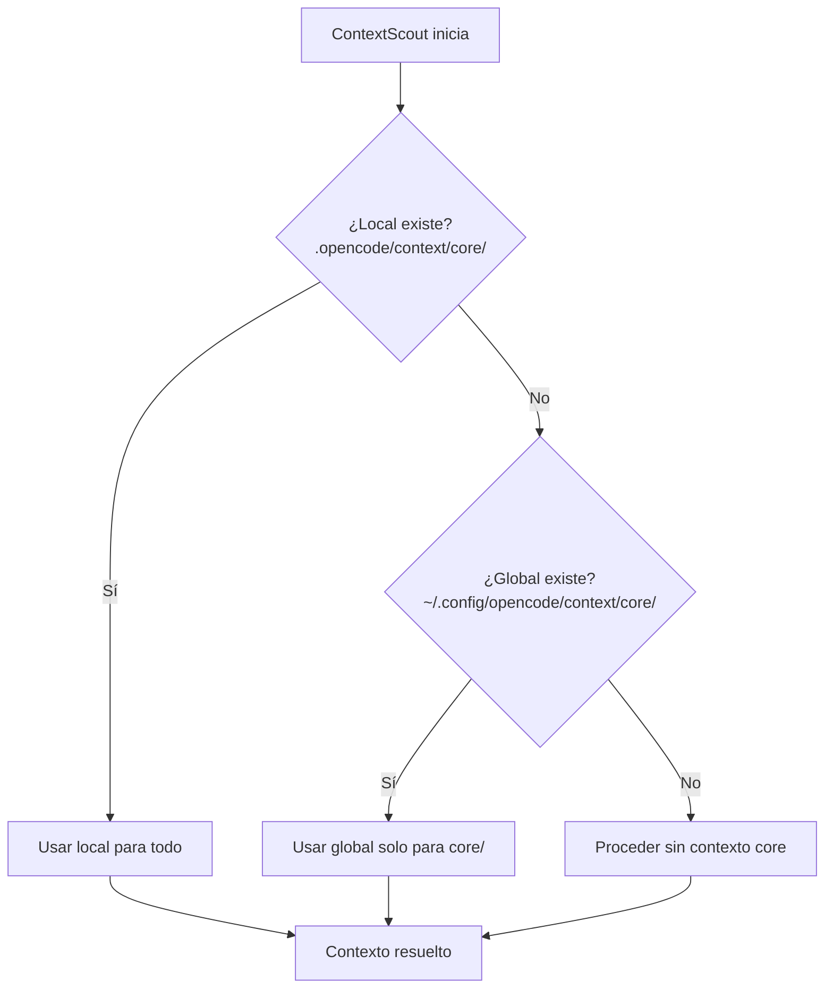

**Reglas de resolución:**

| Regla | Descripción |
|-------|-------------|
| **Local siempre gana** | Si instalaste localmente, global nunca se verifica |
| **Global fallback solo para core/** | Archivos universales (estándares, workflows) |
| **Project intelligence siempre local** | Tu tech stack y patrones viven en `.opencode/context/project-intelligence/` |
| **One-time check** | ContextScout resuelve ubicación core una vez al startup (máx 2 glob checks) |

**Para equipos:**

```bash
# Líder de equipo añade patrones una vez
/add-context
# Responde preguntas con estándares del equipo

# Commit al repo
git add .opencode/context/
git commit -m "Add team coding standards"
git push

# Todo el equipo usa los mismos patrones automáticamente
# Nuevos desarrolladores heredan estándares el día 1
```

**Referencia verificada:** `darrenhinde/OpenAgentsControl` README, sección "The Context System".

---

### ContextScout

**Definición:**  
Agente especializado en descubrimiento inteligente de patrones que encuentra archivos de contexto relevantes antes de la generación de código, rankeándolos por prioridad (Crítica → Alta → Media).

**Explicación contextualizada:**  
ContextScout es el "arma secreta" de OpenAgentsControl. Antes de generar código, descubre qué patrones del proyecto son relevantes para la tarea actual, previniendo trabajo desperdiciado y asegurando que el código generado coincida con los estándares del proyecto.

**Flujo de ContextScout:**

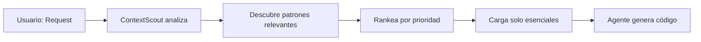

**Prioridades de contexto:**

| Prioridad | Tipo de Contexto | Ejemplo |
|-----------|------------------|---------|
| **Crítica** | Patrones que DEBEN seguirse | Validación Zod, formato de respuesta API |
| **Alta** | Estándares importantes | Convenciones de nombres, estructura de archivos |
| **Media** | Guías opcionales | Estilos de comentarios, organización de imports |

**Ejemplo de descubrimiento:**

```
Usuario: "Crear endpoint de autenticación"

ContextScout descubre:
1. ✅ CRÍTICA: .opencode/context/project-intelligence/patterns.md
   - Tu patrón de validación Zod
   - Tu formato de respuesta de error
   
2. ✅ ALTA: .opencode/context/project-intelligence/naming.md
   - Convención kebab-case para archivos
   - CamelCase para variables
   
3. ✅ MEDIA: .opencode/context/core/standards.md
   - Estándares TypeScript strict
   - Requisitos de seguridad

Contexto cargado: 750 tokens (vs 8,000 tokens de código completo)
```

**Beneficios:**

| Beneficio | Impacto |
|-----------|---------|
| **Previene refactoring** | Código coincide con patrones desde el inicio |
| **Eficiencia de tokens** | Solo carga lo relevante (~80% reducción) |
| **Consistencia** | Todo el código sigue los mismos estándares |
| **Velocidad** | Respuestas más rápidas con contexto pequeño |

**Referencia verificada:** `darrenhinde/OpenAgentsControl` README, sección "ContextScout".

---

### ExternalScout

**Definición:**  
Agente especializado que obtiene documentación en vivo de librerías externas, APIs y frameworks, eliminando el problema de datos de entrenamiento desactualizados.

**Explicación contextualizada:**  
Working with external libraries? ExternalScout fetches current documentation automatically when agents detect external dependencies. No more "this API changed 6 months ago" problems.

**Fuentes soportadas:**

| Fuente | Tipo | Ejemplo |
|--------|------|---------|
| **npm** | Paquetes Node.js | `express`, `react`, `drizzle-orm` |
| **GitHub** | Repositorios | Docs en README, wikis |
| **Sitios oficiales** | Documentación | `nextjs.org/docs`, `drizzle.team/docs` |
| **APIs** | Documentación de API | Stripe API, Twilio API |

**Flujo de ExternalScout:**

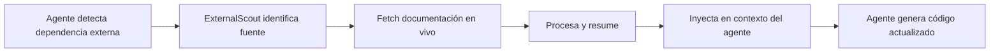

**Cuándo se activa:**

| Trigger | Ejemplo |
|---------|---------|
| **Import de librería** | `import { eq } from "drizzle-orm"` |
| **Mención de API** | "Usa Stripe para pagos" |
| **Framework externo** | "Crea componente con Shadcn UI" |
| **Package nuevo** | Dependencia añadida a package.json |

**Ejemplo de uso:**

```
Usuario: "Integra Stripe para pagos recurrentes"

Agente detecta: Stripe SDK (dependencia externa)
ExternalScout se activa automáticamente:
1. Fetch: https://stripe.com/docs/api/subscriptions
2. Procesa: Métodos relevantes, parámetros, ejemplos
3. Inyecta: Contexto actualizado en el agente

Resultado: Código usando API actual de Stripe
(no datos de entrenamiento de hace 6 meses)
```

**Beneficios:**

| Beneficio | Descripción |
|-----------|-------------|
| **Sin datos desactualizados** | Siempre obtiene docs actuales |
| **Automático** | Se activa cuando se detectan dependencias |
| **Multi-fuente** | npm, GitHub, docs oficiales, APIs |
| **Resumido** | Procesa y extrae solo lo relevante |

**Referencia verificada:** `darrenhinde/OpenAgentsControl` README, sección "ExternalScout".

---

## 7. Apéndices

### Tabla Comparativa de Soluciones de Orquestación

| Característica | OpenAgentsControl | opencode-ensemble | agent-team | opencode-workspace | orchestra | opencode-baseline |
|----------------|-------------------|-------------------|------------|--------------------|-----------|-------------------|
| **Repositorio** | `darrenhinde/OpenAgentsControl` | `hueyexe/opencode-ensemble` | `JsonLee12138/agent-team` | `kdcokenny/opencode-workspace` | `0xSero/orchestra` | `48Nauts-Operator/opencode-baseline` |
| **Stars** | 3,900 | 73 | 25 | N/A | 273 | 3 |
| **Enfoque** | CONTROL + REPETIBILIDAD | VELOCIDAD + AUTONOMÍA | AISLAMIENTO | BUNDLE COMPLETO | HUB-and-SPOKE | TEMPLATE PRODUCTION |
| **Aislamiento** | Contexto MVI | Worktrees opcionales | Worktrees obligatorios | Worktrees | Sesiones aisladas | No especificado |
| **Aprobación** | ✅ SIEMPRE obligatoria | ⚠️ Opcional | ✅ Manual | ⚠️ Configurables | ⚠️ Configurables | ⚠️ Configurables |
| **Dashboard** | ❌ | ✅ Web puerto 4747 | ❌ | ❌ | ❌ | ❌ |
| **Mensajería** | ✅ Reply/main | ✅ Peer-to-peer + broadcast | ✅ Reply/main | ❌ | ✅ Task API | ❌ |
| **Tablero de tareas** | ✅ Artifacts | ✅ Con dependencias | ✅ Artifacts | ❌ | ✅ 5-tool API | ❌ |
| **Agents incluidos** | 3 main + 9 subagents | Configurables | 4 roles built-in | 4 agentes | 6 workers | 35 agentes |
| **Skills incluidos** | 9 workflow skills | ❌ | 14 skills | 4 skills | ❌ | 55 skills |
| **MCP Servers** | ❌ | ❌ | ❌ | 3 servers | ❌ | ❌ |
| **Plugins incluidos** | ❌ | 1 (él mismo) | ❌ | 6 plugins | 1 (él mismo) | 3 plugins |
| **Commands** | 9+ commands | ❌ | 14 commands | 1 command | ❌ | 18 commands |
| **Hooks** | ❌ | ❌ | ❌ | ❌ | ❌ | 6 hooks |
| **QA Loop** | ✅ Validación humana | ❌ | ✅ 90% threshold | ❌ | ❌ | ❌ |
| **Brainstorming** | ❌ | ❌ | ✅ Skill validado | ❌ | ❌ | ❌ |
| **Jester variants** | ❌ | ❌ | ❌ | ❌ | ❌ | ❌ |
| **Model pool** | ✅ Cualquier modelo | ✅ Rotación/random | ❌ | ❌ | ✅ Auto-resolve | ❌ |
| **Compaction safety** | ❌ | ✅ | ❌ | ❌ | ❌ | ❌ |
| **Stall detection** | ❌ | ✅ Timeout watchdog | ❌ | ❌ | ❌ | ❌ |
| **Rate limiting** | ❌ | ✅ Token bucket | ❌ | ❌ | ❌ | ❌ |
| **Crash recovery** | ❌ | ✅ | ❌ | ❌ | ❌ | ❌ |
| **Auto-merge** | ❌ | ✅ Unstaged changes | Manual merge | ❌ | ❌ | ❌ |
| **ContextScout** | ✅ Descubrimiento patrones | ❌ | ❌ | ❌ | ❌ | ❌ |
| **ExternalScout** | ✅ Docs en vivo | ❌ | ❌ | ❌ | ❌ | ❌ |
| **Eficiencia tokens** | ✅ 80% reducción (MVI) | ❌ Contexto completo | ❌ Contexto completo | ❌ | ❌ | ❌ |
| **Estándares equipo** | ✅ Archivos contexto compartidos | ❌ Por usuario | ❌ | ❌ | ❌ | ❌ |
| **Editar agentes** | ✅ Markdown editable | ⚠️ JSON config | ⚠️ JSON config | ⚠️ JSON config | ⚠️ JSON config | ⚠️ JSON config |

---

### Diagrama de Arquitectura Multi-Agente

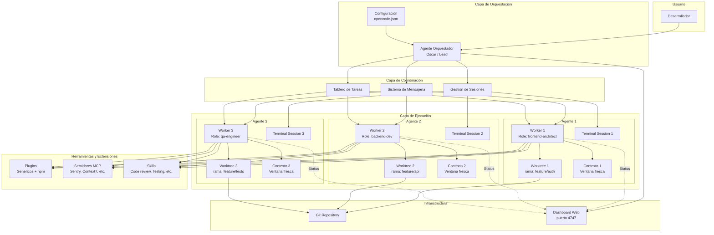

---

## Glosario de Términos Relacionados

| Término | Definición Breve |
|---------|------------------|
| **Agente** | Asistente de IA configurado para tareas específicas |
| **Agente Primario** | Agente principal con el que el usuario interactúa directamente |
| **Sub-agente** | Agente especializado invocado por agentes primarios |
| **Build Mode** | Modo de agente con todas las herramientas habilitadas |
| **Plan Mode** | Modo de agente restringido para análisis sin cambios |
| **Prompt del Sistema** | Instrucciones iniciales que definen el comportamiento del agente |
| **Tool** | Función que el agente puede ejecutar (read, write, bash, etc.) |
| **Permission** | Control de qué herramientas/comandos puede usar un agente |
| **Skill** | Módulo de conocimiento reutilizable que los agentes pueden cargar |
| **Worktree** | Directorio de trabajo Git aislado |
| **Session** | Instancia de conversación entre usuario y agente |
| **Context Window** | Límite de tokens que el LLM puede procesar en una llamada |
| **Compaction** | Proceso de resumir conversaciones largas para ahorrar contexto |
| **MCP** | Model Context Protocol, estándar para conectar herramientas externas |
| **Plugin** | Módulo que extiende funcionalidad de OpenCode |
| **Bundle** | Paquete pre-empaquetado de múltiples componentes |
| **Role** | Paquete de habilidades reutilizable (patrón Role+Worker) |
| **Worker** | Instancia de ejecución aislada de un Role |
| **Orchestrator** | Agente que coordina y delega trabajo a otros agentes |
| **QA Loop** | Bucle iterativo de revisión hasta alcanzar umbral de calidad |
| **MVI** | Minimal Viable Information - principio de eficiencia de tokens |
| **ContextScout** | Agente de descubrimiento inteligente de patrones |
| **ExternalScout** | Agente que obtiene documentación en vivo de librerías |
| **Approval Gates** | Puertas de aprobación obligatoria antes de ejecución |
| **OAC** | OpenAgentsControl - framework de control y repetibilidad |

---

### Comparativa: OpenAgentsControl vs opencode-ensemble

**Filosofías opuestas:** OpenAgentsControl (OAC) y opencode-ensemble (OME) representan dos enfoques diferentes para el desarrollo con agentes de IA.

| Dimensión | OpenAgentsControl | opencode-ensemble |
|-----------|-------------------|-------------------|
| **Filosofía** | CONTROL + REPETIBILIDAD | VELOCIDAD + AUTONOMÍA |
| **Lema implícito** | "Code that ships without refactoring" | "Parallel agents, one coordinated team" |
| **Aprobación** | ✅ SIEMPRE obligatoria (no configurable) | ⚠️ Opcional (default off) |
| **Patrones de código** | ✅ Sistema de contexto MVI aprendido | ❌ No tiene sistema de patrones |
| **Eficiencia de tokens** | ✅ 80% reducción (MVI) | ❌ Contexto completo cargado |
| **Estándares de equipo** | ✅ Archivos de contexto compartidos | ❌ Configuración por usuario |
| **Editar comportamiento** | ✅ Archivos markdown editables | ⚠️ Configuración JSON |
| **Elección de modelo** | ✅ Cualquier modelo/provider | ✅ Múltiples modelos con pool |
| **Velocidad de ejecución** | ⚠️ Secuencial con aprobación | ✅ Agentes paralelos |
| **Recuperación de errores** | ✅ Guiada por humano | ✅ Auto-corrección |
| **Dashboard** | ❌ Sin dashboard | ✅ Web en puerto 4747 |
| **Mensajería** | ✅ Reply/main | ✅ Peer-to-peer + broadcast |
| **Aislamiento** | Contexto MVI | Worktrees opcionales |
| **Mejor para** | Producción, equipos, consistencia | Prototipado rápido, velocidad |

#### Cuándo usar OpenAgentsControl

| Escenario | Recomendación | Razón |
|-----------|---------------|-------|
| ✅ Tienes patrones de código establecidos | **USAR OAC** | Aprende y aplica tus patrones |
| ✅ Quieres código que se shippea sin refactoring | **USAR OAC** | Código coincide desde el inicio |
| ✅ Necesitas puertas de aprobación para control de calidad | **USAR OAC** | Aprobación siempre obligatoria |
| ✅ Te importa eficiencia de tokens y costos | **USAR OAC** | 80% reducción con MVI |
| ✅ Trabajas en equipo con estándares compartidos | **USAR OAC** | Contexto compartido en repo |
| ✅ Producción crítica que requiere trazabilidad | **USAR OAC** | Approval gates dejan audit trail |

#### Cuándo usar opencode-ensemble

| Escenario | Recomendación | Razón |
|-----------|---------------|-------|
| ✅ Prototipado rápido | **USAR OME** | Ejecución paralela más rápida |
| ✅ No tienes patrones establecidos aún | **USAR OME** | Sin overhead de contexto |
| ✅ Prefieres modo "just do it" | **USAR OME** | Sin aprobación obligatoria |
| ✅ Necesitas paralelización multi-agente | **USAR OME** | Dashboard + coordinación |
| ✅ Velocidad sobre control | **USAR OME** | Autonomía sobre aprobación |
| ✅ Experimentación exploratoria | **USAR OME** | Múltiples agentes en paralelo |

#### Test rápido de decisión

```
Pregunta 1: ¿Tienes estándares de código documentados?
  Sí → OAC (aprende patrones)
  No → OME (sin overhead)

Pregunta 2: ¿Quieres aprobación obligatoria antes de cambios?
  Sí → OAC (approval gates siempre on)
  No → OME (configurable)

Pregunta 3: ¿Te importa más velocidad o consistencia?
  Velocidad → OME (paralelo)
  Consistencia → OAC (patrones)

Pregunta 4: ¿Trabajas en equipo con estándares compartidos?
  Sí → OAC (contexto en repo)
  No → Either (personal preference)

Pregunta 5: ¿El código va a producción sin refactoring?
  Sí → OAC (code that ships)
  No → OME (prototyping ok)
```

**Conclusión:**  
- **OAC** = Producción, equipos, consistencia, control de calidad
- **OME** = Prototipado, velocidad, exploración, autonomía

> **Nota:** OAC = OpenAgentsControl, OME = opencode-ensemble (Oh My OpenCode)

---

## Referencias y Fuentes Verificadas

### Documentación Oficial OpenCode
- **Intro:** https://opencode.ai/docs/
- **Agents:** https://opencode.ai/docs/agents/
- **Plugins:** https://opencode.ai/docs/plugins/
- **MCP Servers:** https://opencode.ai/docs/mcp-servers/
- **Skills:** https://opencode.ai/docs/skills/

### Repositorios Analizados
- **OpenAgentsControl:** https://github.com/darrenhinde/OpenAgentsControl (3.9k stars)
- **opencode-ensemble:** https://github.com/hueyexe/opencode-ensemble
- **agent-team:** https://github.com/JsonLee12138/agent-team
- **opencode-agents:** https://github.com/wildwasser/opencode-agents
- **opencode-workspace:** https://github.com/kdcokenny/opencode-workspace
- **opencode-baseline:** https://github.com/48Nauts-Operator/opencode-baseline
- **orchestra:** https://github.com/0xSero/orchestra

### Informe de Análisis
- **Ubicación:** `temp/00 analisis-repositorios-opencode.md`
- **Fecha:** 5 de mayo de 2026

---

> **Nota de Mantenimiento:** Este glosario debe actualizarse cuando haya cambios en la documentación oficial de OpenCode o cuando emerjan nuevos patrones y herramientas en el ecosistema. Todas las definiciones están basadas en información verificada al 5 de mayo de 2026.
>
> **Historial de versiones:**
> - **v1.1** (5 mayo 2026): Añadida sección 6 "Sistemas de Control y Aprobación" con OpenAgentsControl, ContextScout, ExternalScout, MVI y Approval Gates. Actualizada tabla comparativa y referencias.
> - **v1.0** (5 mayo 2026): Versión inicial con 21 conceptos en 5 categorías.
