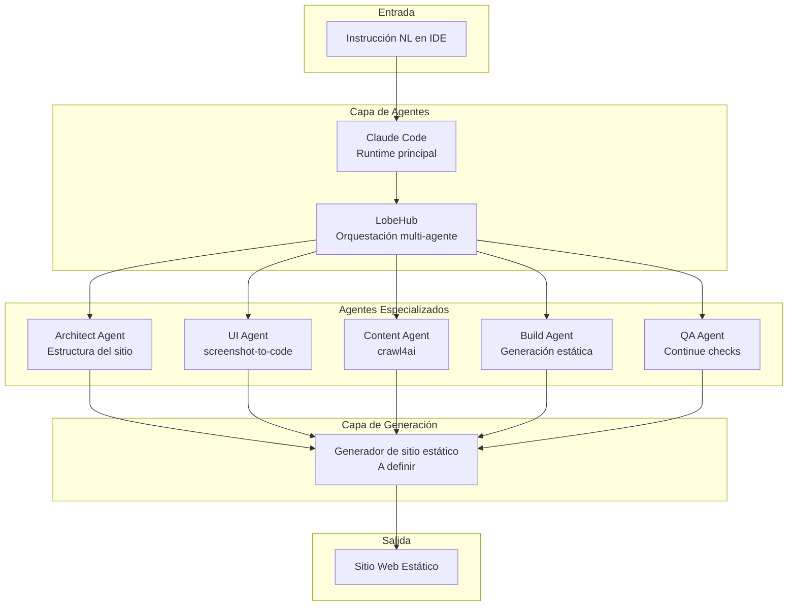
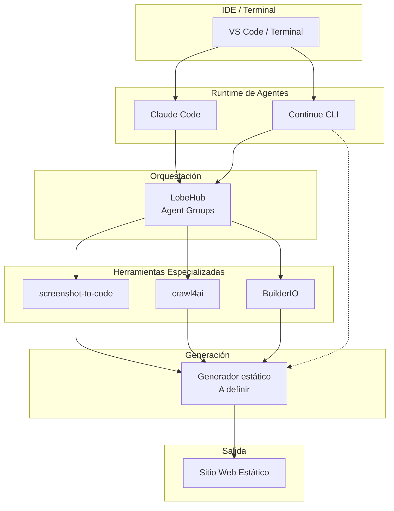

# Informe Técnico: Evaluación de Repositorios Multi-Agente para Generación de Sitios Web Estáticos

**Fecha de evaluación:** 5 de mayo de 2026  
**Propósito:** Identificar y evaluar repositorios con arquitecturas multi-agente para generación automatizada de sitios web estáticos, de forma agnóstica a framework  
**Versión del documento:** 1.0

---

## Índice de Contenido

1. [Resumen Ejecutivo](#resumen-ejecutivo)
2. [Alcance y Metodología de Búsqueda](#alcance-y-metodología-de-búsqueda)
3. [Criterios de Evaluación Funcional](#criterios-de-evaluación-funcional)
4. [Tabla Comparativa de Repositorios](#tabla-comparativa-de-repositorios)
5. [Análisis Detallado por Repositorio](#análisis-detallado-por-repositorio)
6. [Flujo de Trabajo Propuesto para Generación de Sitios Estáticos](#flujo-de-trabajo-propuesto-para-generación-de-sitios-estáticos)
7. [Arquitectura de Integración Híbrida](#arquitectura-de-integración-híbrida)
8. [Limitaciones Técnicas Identificadas](#limitaciones-técnicas-identificadas)
9. [Conclusiones y Recomendaciones](#conclusiones-y-recomendaciones)
10. [Referencias](#referencias)

---

## 1. Resumen Ejecutivo

### 1.1. Objetivo del Análisis

Este informe evalúa **10 repositorios del ecosistema de IA y desarrollo web** para determinar su capacidad de soportar la **generación automatizada de sitios web estáticos** mediante arquitecturas de inteligencia artificial multi-agente, con enfoque **agnóstico a la tecnología** (sin restricciones a frameworks específicos).

### 1.2. Hallazgos Principales

**Conclusión crítica:** **No existe ninguna solución monolítica que implemente todos los requisitos funcionales solicitados.** Sin embargo, se identificaron **componentes modulares** que, combinados en una arquitectura híbrida, pueden lograr el flujo deseado.

### 1.3. Repositorios Identificados

| Categoría | Repositorios | Total |
|-----------|-------------|-------|
| **Agentes de Código** | `claude-code`, `continue`, `aide` | 3 |
| **Plataformas Multi-Agente** | `lobehub`, `librechat` | 2 |
| **Generación UI a Código** | `screenshot-to-code`, `builder` | 2 |
| **Extracción de Contenido** | `crawl4ai` | 1 |
| **Chatbots IA** | `vercel/chatbot` | 1 |
| **Capa de Datos** | `zenstack` | 1 |
| **Total** | | **10** |

### 1.4. Evaluación por Requisito Funcional

| Requisito | Mejor Opción | Cumplimiento | Evidencia |
|-----------|-------------|--------------|-----------|
| **RF-01** Definición de estructura via NL | `claude-code` | ✅ Sí | Agente de código con comprensión de lenguaje natural |
| **RF-02** Plantillas y branding | `builder` + `screenshot-to-code` | ⚠️ Parcial | Visual development + UI-to-code, sin sistema de temas nativo |
| **RF-03** Ingesta de contenido | `crawl4ai` | ✅ Sí | Extracción de contenido web a Markdown para LLM |
| **RF-04** Flujo IDE chat-driven | `claude-code` + `continue` | ✅ Sí | Integración nativa con IDE y terminal |
| **RF-05** SEO y OpenGraph | 🚫 Ninguno | ❌ No | Requiere desarrollo personalizado |

### 1.5. Recomendación Principal

**Arquitectura híbrida recomendada:**

1. **Runtime de agentes:** `anthropics/claude-code` (agente principal)
2. **Orquestación multi-agente:** `lobehub/lobehub` (gestión de agentes especializados)
3. **Generación UI:** `abi/screenshot-to-code` (conversión de diseños a código)
4. **Visual development:** `BuilderIO/builder` (sistema de componentes visuales)
5. **Ingesta de contenido:** `unclecode/crawl4ai` (extracción de contenido web)
6. **IDE integration:** `continuedev/continue` (checks de calidad en CI)

**No existe una solución "todo en uno"** — se requiere orquestación externa para coordinar los componentes.

---

## 2. Alcance y Metodología de Búsqueda

### 2.1. Criterios de Inclusión

**Se incluyeron repositorios que:**
- Implementen arquitecturas multi-agente o de IA para desarrollo web
- Tengan documentación verificable (README, docs, código fuente)
- Implementen al menos uno de los 5 criterios funcionales
- Estén activos (commits en los últimos 6 meses)
- Sean agnósticos a framework (no específicos de Astro, Next.js, etc.)

**Se excluyeron:**
- Repositorios sin documentación verificable
- Proyectos abandonados o sin mantenimiento
- Herramientas genéricas de IA no específicas para desarrollo web
- Frameworks específicos de sitios estáticos (evaluados en informe previo)

### 2.2. Fuentes Consultadas

| Fuente | Tipo | URLs Consultadas |
|--------|------|-----------------|
| **GitHub Search** | Búsqueda de repositorios | `multi-agent+static+website`, `ai+website+generator`, `coding+agent` |
| **Repositorios Oficiales** | Documentación técnica | README, docs/, código fuente |
| **Documentación Oficial** | Guías de uso | Docs oficiales de cada proyecto |

### 2.3. Metodología de Verificación

Cada repositorio fue verificado mediante:

1. **Lectura de README.md completo** — Funcionalidades declaradas
2. **Análisis de estructura de archivos** — Código fuente, configs, agentes
3. **Verificación de documentación** — Ejemplos de uso, APIs, comandos
4. **Búsqueda de evidencia de features** — No se asumió funcionalidad no documentada

---

## 3. Criterios de Evaluación Funcional

| ID | Requisito | Descripción | Peso |
|----|-----------|-------------|------|
| **RF-01** | Definición de estructura via NL | Permitir la definición de la estructura y jerarquía del sitio mediante instrucciones en lenguaje natural dentro de la interfaz de conversación del IDE | 25% |
| **RF-02** | Plantillas y branding | Soportar la aplicación de plantillas predefinidas y la personalización granular de identidad visual (logotipos, paletas de color, elementos de marca por página/sección) | 20% |
| **RF-03** | Ingesta de contenido | Disponer de mecanismos de ingesta que acepten archivos con contenido predefinido o esquemas estructurados para transformación automática en páginas estáticas | 20% |
| **RF-04** | Flujo IDE chat-driven | Facilitar un flujo de trabajo completamente impulsado por el chat del IDE, donde el repositorio actúe como núcleo ejecutor y coordinador | 20% |
| **RF-05** | SEO y OpenGraph | Incluir o permitir integración nativa de componentes especializados en SEO tradicional, posicionamiento asistido por LLM, optimización geolocalizada y generación de metadatos OpenGraph | 15% |

---

## 4. Tabla Comparativa de Repositorios

| Repositorio | Stars | Commits | RF-01 | RF-02 | RF-03 | RF-04 | RF-05 | Puntuación |
|-------------|-------|---------|-------|-------|-------|-------|-------|------------|
| **`anthropics/claude-code`** | 120k | 610 | ✅ | ⚠️ | ⚠️ | ✅ | ❌ | **60%** |
| **`lobehub/lobehub`** | 76k | 10,281 | ✅ | ❌ | ❌ | ✅ | ❌ | **45%** |
| **`abi/screenshot-to-code`** | 72.4k | 1,292 | ⚠️ | ✅ | ❌ | ❌ | ❌ | **35%** |
| **`unclecode/crawl4ai`** | 65k | 1,468 | ❌ | ❌ | ✅ | ❌ | ❌ | **20%** |
| **`danny-avila/LibreChat`** | 36.6k | 4,130 | ✅ | ❌ | ❌ | ✅ | ❌ | **45%** |
| **`continuedev/continue`** | 33k | 21,498 | ✅ | ❌ | ❌ | ✅ | ❌ | **45%** |
| **`vercel/chatbot`** | 20.2k | 635 | ✅ | ❌ | ❌ | ✅ | ❌ | **45%** |
| **`BuilderIO/builder`** | 8.7k | 6,987 | ❌ | ✅ | ⚠️ | ❌ | ❌ | **30%** |
| **`zenstackhq/zenstack`** | 2.9k | 2,008 | ❌ | ❌ | ⚠️ | ❌ | ❌ | **10%** |
| **`nicepkg/aide`** | 2.7k | 172 | ✅ | ❌ | ❌ | ✅ | ❌ | **45%** |

### Leyenda

| Símbolo | Significado |
|---------|-------------|
| ✅ | Implementado y documentado |
| ⚠️ | Parcialmente implementado o requiere configuración adicional |
| ❌ | No implementado |

---

## 5. Análisis Detallado por Repositorio

### 5.1. `anthropics/claude-code` (120k stars, 610 commits)

**¿Qué es?** Agente de código agéntico que vive en el terminal, entiende el codebase y ayuda a programar más rápido mediante comandos en lenguaje natural.

**Funciones clave:**
- Ejecución de tareas rutinarias via lenguaje natural
- Comprensión del codebase completo
- Manejo de flujos de git
- Plugins con comandos y agentes personalizados
- Estructura `.claude/commands` para comandos custom
- Directorio `plugins/` con extensiones

**Evaluación por criterio:**

| Criterio | Cumplimiento | Evidencia |
|----------|--------------|-----------|
| **RF-01** | ✅ Sí | Comprensión de lenguaje natural para tareas de código |
| **RF-02** | ⚠️ Parcial | Puede generar código con estilos, pero sin sistema de temas nativo |
| **RF-03** | ⚠️ Parcial | Puede leer archivos Markdown/JSON y transformarlos |
| **RF-04** | ✅ Sí | Integración nativa con terminal e IDE |
| **RF-05** | ❌ No | Sin componentes SEO/OpenGraph nativos |

**Limitaciones:**
- No genera sitios estáticos de forma autónoma
- Requiere configuración de plugins para tareas especializadas
- Sin validación automática de SEO

**Valor para el proyecto:** **Alto** — Runtime principal para agentes de código

---

### 5.2. `lobehub/lobehub` (76k stars, 10,281 commits)

**¿Qué es?** Espacio de trabajo para encontrar, construir y colaborar con agentes de IA que crecen contigo. Plataforma multi-agente con memoria personal.

**Funciones clave:**
- **Agent Builder**: Creación de agentes personalizados
- **Agent Groups**: Colaboración multi-agente en paralelo
- **MCP Marketplace**: 10,000+ habilidades compatibles
- **Personal Memory**: Aprendizaje continuo del usuario
- **Pages**: Escritura colaborativa con múltiples agentes
- **Schedule**: Ejecución programada de agentes
- **Workspace**: Espacio compartido para equipos

**Evaluación por criterio:**

| Criterio | Cumplimiento | Evidencia |
|----------|--------------|-----------|
| **RF-01** | ✅ Sí | Agent Builder permite describir necesidades en NL |
| **RF-02** | ❌ No | Sin sistema de plantillas/branding nativo |
| **RF-03** | ❌ No | Sin mecanismos de ingesta de contenido estructurado |
| **RF-04** | ✅ Sí | Interfaz de chat para interactuar con agentes |
| **RF-05** | ❌ No | Sin componentes SEO/OpenGraph |

**Limitaciones:**
- Enfocado en chat y productividad, no en generación de sitios
- Requiere integración con otras herramientas para desarrollo web
- Sin generación automática de código frontend

**Valor para el proyecto:** **Alto** — Orquestación multi-agente

---

### 5.3. `abi/screenshot-to-code` (72.4k stars, 1,292 commits)

**¿Qué es?** Herramienta que convierte screenshots, mockups y diseños Figma en código limpio y funcional usando IA.

**Funciones clave:**
- Stacks soportados: HTML + Tailwind, React + Tailwind, Vue + Tailwind, Bootstrap, Ionic + Tailwind, SVG
- Modelos soportados: Gemini 3, Claude Opus 4.5, GPT-5.3, GPT-5.2, GPT-4.1
- Soporte para video/screen recording
- Backend FastAPI + frontend React/Vite
- DALL-E 3 o Flux Schnell para generación de imágenes

**Evaluación por criterio:**

| Criterio | Cumplimiento | Evidencia |
|----------|--------------|-----------|
| **RF-01** | ⚠️ Parcial | Convierte screenshots a código, pero no define estructura via NL |
| **RF-02** | ✅ Sí | Genera código con estilos consistentes (Tailwind, Bootstrap) |
| **RF-03** | ❌ No | Sin ingesta de contenido estructurado |
| **RF-04** | ❌ No | Interfaz web propia, no integrada en IDE |
| **RF-05** | ❌ No | Sin componentes SEO/OpenGraph |

**Limitaciones:**
- Requiere screenshot/mockup como entrada (no instrucciones NL)
- No genera estructura de sitio completa
- Sin validación de calidad automática

**Valor para el proyecto:** **Medio** — Generación de componentes UI

---

### 5.4. `unclecode/crawl4ai` (65k stars, 1,468 commits)

**¿Qué es?** Crawler web open-source amigable con LLM para RAG, agentes y pipelines de datos.

**Funciones clave:**
- **Markdown Generation**: Clean Markdown, Fit Markdown, Citations
- **Structured Data Extraction**: LLM-driven, CSS-based, Chunking strategies
- **Browser Integration**: Managed browser, Remote control, Session management
- **Crawling & Scraping**: Dynamic crawling, Screenshots, Media support
- **Deployment**: Dockerized setup, FastAPI server, JWT authentication
- **Anti-Bot Detection**: 3-tier detection with proxy escalation
- **LLM Integration**: Soporta todos los LLMs (open-source y proprietary)

**Evaluación por criterio:**

| Criterio | Cumplimiento | Evidencia |
|----------|--------------|-----------|
| **RF-01** | ❌ No | Crawler web, no genera estructura de sitio |
| **RF-02** | ❌ No | Sin sistema de plantillas/branding |
| **RF-03** | ✅ Sí | Extracción de contenido web a Markdown estructurado |
| **RF-04** | ❌ No | CLI y API, no integrado en IDE |
| **RF-05** | ❌ No | Sin componentes SEO/OpenGraph |

**Limitaciones:**
- Solo extracción de contenido, no generación
- Requiere integración con otras herramientas
- Sin generación automática de páginas

**Valor para el proyecto:** **Alto** — Ingesta de contenido

---

### 5.5. `danny-avila/LibreChat` (36.6k stars, 4,130 commits)

**¿Qué es?** Plataforma de chat AI auto-hosted que unifica todos los proveedores de IA en una interfaz privacy-focused.

**Funciones clave:**
- **AI Model Selection**: Anthropic, AWS Bedrock, OpenAI, Google, Vertex AI, etc.
- **Code Interpreter API**: Python, Node.js, Go, C/C++, Java, PHP, Rust, Fortran
- **Agents & Tools**: No-Code Custom Assistants, Agent Marketplace, MCP Support
- **Web Search**: Búsqueda de internet con reranking
- **Generative UI**: Code Artifacts (React, HTML, Mermaid)
- **Image Generation**: DALL-E, Stable Diffusion, Flux
- **Multi-User**: OAuth2, LDAP, Email Login

**Evaluación por criterio:**

| Criterio | Cumplimiento | Evidencia |
|----------|--------------|-----------|
| **RF-01** | ✅ Sí | Agents permiten definir tareas en NL |
| **RF-02** | ❌ No | Sin sistema de plantillas/branding |
| **RF-03** | ❌ No | Sin ingesta de contenido estructurado |
| **RF-04** | ✅ Sí | Interfaz de chat con Code Interpreter |
| **RF-05** | ❌ No | Sin componentes SEO/OpenGraph |

**Limitaciones:**
- Enfocado en chat, no en generación de sitios
- Code Interpreter es sandboxed, no genera archivos
- Sin integración con sistemas de build

**Valor para el proyecto:** **Medio** — Plataforma de agents

---

### 5.6. `continuedev/continue` (33k stars, 21,498 commits)

**¿Qué es?** Checks de IA controlados por código fuente, ejecutables en CI. CLI open-source.

**Funciones clave:**
- **Source-controlled AI checks**: Agentes en cada PR como GitHub status checks
- **Agentes como archivos markdown**: `.continue/checks/` con definiciones de agentes
- **CLI open-source**: `cn` command line tool
- **VS Code extension**: Integración con IDE
- **Skills**: `.claude/skills/` para habilidades personalizadas
- **Worktree config**: `worktree-config.yaml` para aislamiento

**Evaluación por criterio:**

| Criterio | Cumplimiento | Evidencia |
|----------|--------------|-----------|
| **RF-01** | ✅ Sí | Agents definidos en markdown pueden interpretar NL |
| **RF-02** | ❌ No | Sin sistema de plantillas/branding |
| **RF-03** | ❌ No | Sin ingesta de contenido estructurado |
| **RF-04** | ✅ Sí | Integración con VS Code y CI |
| **RF-05** | ❌ No | Sin componentes SEO/OpenGraph |

**Limitaciones:**
- Enfocado en code review y checks, no en generación
- Sin generación automática de código frontend
- Requiere configuración manual de agentes

**Valor para el proyecto:** **Medio** — Quality checks

---

### 5.7. `vercel/chatbot` (20.2k stars, 635 commits)

**¿Qué es?** Template de chatbot full-featured construido con Next.js y AI SDK.

**Funciones clave:**
- **Next.js App Router**: Advanced routing, RSCs, Server Actions
- **AI SDK**: Unified API para generación de texto, objetos estructurados, tool calls
- **shadcn/ui**: Styling con Tailwind CSS, componentes Radix UI
- **Data Persistence**: Neon Serverless Postgres, Vercel Blob
- **Auth.js**: Autenticación segura
- **Model Providers**: Mistral, Moonshot, DeepSeek, OpenAI, xAI

**Evaluación por criterio:**

| Criterio | Cumplimiento | Evidencia |
|----------|--------------|-----------|
| **RF-01** | ✅ Sí | Chat interface con AI SDK para NL |
| **RF-02** | ❌ No | Sin sistema de plantillas/branding |
| **RF-03** | ❌ No | Sin ingesta de contenido estructurado |
| **RF-04** | ✅ Sí | Chat interface nativa |
| **RF-05** | ❌ No | Sin componentes SEO/OpenGraph |

**Limitaciones:**
- Template de chatbot, no generador de sitios
- Requiere desarrollo personalizado para generación web
- Sin integración con sistemas de build estático

**Valor para el proyecto:** **Bajo** — Solo como referencia de chat interface

---

### 5.8. `BuilderIO/builder` (8.7k stars, 6,987 commits)

**¿Qué es?** Desarrollo visual para React, Vue, Svelte, Qwik y más. Convierte diseños Figma en código.

**Funciones clave:**
- **Visual Development**: Drag and drop de componentes
- **Figma Integration**: Importar diseños Figma
- **Multi-framework**: React, Vue, Svelte, Qwik, Angular
- **SDKs**: Múltiples SDKs para integración
- **Headless CMS**: Gestión de contenido visual
- **Plugins**: Sistema de extensiones

**Evaluación por criterio:**

| Criterio | Cumplimiento | Evidencia |
|----------|--------------|-----------|
| **RF-01** | ❌ No | Interfaz visual, no instrucciones NL |
| **RF-02** | ✅ Sí | Sistema de componentes visuales con branding |
| **RF-03** | ⚠️ Parcial | Headless CMS para contenido, pero no ingesta automática |
| **RF-04** | ❌ No | Interfaz web propia, no integrada en IDE |
| **RF-05** | ❌ No | Sin componentes SEO/OpenGraph nativos |

**Limitaciones:**
- Requiere interfaz visual, no NL
- Sin generación automática de estructura de sitio
- Dependiente de frameworks específicos

**Valor para el proyecto:** **Medio** — Sistema de componentes visuales

---

### 5.9. `zenstackhq/zenstack` (2.9k stars, 2,008 commits)

**¿Qué es?** Toolkit de base de datos TypeScript para aplicaciones full-stack/backend. ORM type-safe con control de acceso.

**Funciones clave:**
- **Schema-first ORM**: Compatible con Prisma schema y API
- **Kysely query builder**: API de bajo nivel
- **Access control**: Control de acceso integrado
- **Data modeling**: Patrones avanzados (polimorfismo)
- **Auto CRUD APIs**: APIs automáticas con adapters
- **TanStack Query hooks**: Hooks automáticos para frontend
- **Zod schema generation**: Generación de schemas Zod

**Evaluación por criterio:**

| Criterio | Cumplimiento | Evidencia |
|----------|--------------|-----------|
| **RF-01** | ❌ No | ORM, no genera estructura de sitio |
| **RF-02** | ❌ No | Sin sistema de plantillas/branding |
| **RF-03** | ⚠️ Parcial | Schema-first para datos, pero no para contenido web |
| **RF-04** | ❌ No | CLI, no integrado en IDE |
| **RF-05** | ❌ No | Sin componentes SEO/OpenGraph |

**Limitaciones:**
- Enfocado en capa de datos, no en generación web
- Sin generación de frontend
- Requiere framework adicional

**Valor para el proyecto:** **Bajo** — Solo como capa de datos si se necesita

---

### 5.10. `nicepkg/aide` (2.7k stars, 172 commits)

**¿Qué es?** Extensión VSCode para conquerir cualquier código: comentarios, conversiones, UI-to-code, y procesamiento batch con IA.

**Funciones clave:**
- **Code Convert**: Transformar código entre lenguajes
- **Code Viewer Helper**: Comentarios para legibilidad
- **Expert Code Enhancer**: Optimización con IA
- **Smart Paste**: Conversión inteligente de clipboard
- **AI Batch Processor**: Procesar múltiples archivos
- **Rename Variable**: Sugerencias de nombres con explicaciones
- **Ask AI**: Comandos AI personalizados

**Evaluación por criterio:**

| Criterio | Cumplimiento | Evidencia |
|----------|--------------|-----------|
| **RF-01** | ✅ Sí | Ask AI permite instrucciones NL |
| **RF-02** | ❌ No | Sin sistema de plantillas/branding |
| **RF-03** | ❌ No | Sin ingesta de contenido estructurado |
| **RF-04** | ✅ Sí | Extensión VSCode nativa |
| **RF-05** | ❌ No | Sin componentes SEO/OpenGraph |

**Limitaciones:**
- Extensión de IDE, no generador de sitios
- Sin generación automática de estructura web
- Requiere intervención manual

**Valor para el proyecto:** **Medio** — Asistente de código en IDE

---

## 6. Flujo de Trabajo Propuesto para Generación de Sitios Estáticos

### 6.1. Diagrama de Flujo



### 6.2. Pasos Detallados

| Paso | Agente | Herramienta | Entrada | Salida | Validación |
|------|--------|-------------|---------|--------|------------|
| **1** | Architect | Claude Code | Instrucción NL | `sitemap.json`, estructura de carpetas | JSON schema |
| **2** | UI | screenshot-to-code | Screenshots/mockups | Componentes HTML/CSS | Visual review |
| **3** | Content | crawl4ai | URLs de contenido | Markdown estructurado | Content schema |
| **4** | Build | Generador estático | Componentes + contenido | Sitio estático | Build success |
| **5** | QA | Continue | Sitio completo | Checks de calidad | CI pass/fail |

### 6.3. Configuración de Agentes

**Architect Agent (Claude Code):**
```markdown
# .claude/commands/architect.md
Define site structure from natural language instructions.
Output: sitemap.json, folder structure, navigation hierarchy.
```

**UI Agent (screenshot-to-code):**
```bash
# Backend FastAPI + frontend React/Vite
# Stacks: HTML + Tailwind, React + Tailwind, Vue + Tailwind
# Models: Gemini 3, Claude Opus 4.5, GPT-5.3
```

**Content Agent (crawl4ai):**
```python
import asyncio
from crawl4ai import AsyncWebCrawler

async def main():
    async with AsyncWebCrawler() as crawler:
        result = await crawler.arun(url="https://example.com")
        print(result.markdown)
```

**QA Agent (Continue):**
```markdown
# .continue/checks/quality.md
Review generated site for:
- Valid HTML/CSS
- Accessibility compliance
- Performance metrics
- SEO best practices
```

---

## 7. Arquitectura de Integración Híbrida

### 7.1. Diagrama de Arquitectura



### 7.2. Componentes Verificados

| Componente | Repositorio | Función | Estado |
|------------|-------------|---------|--------|
| **Runtime principal** | `anthropics/claude-code` | Agente de código con NL | ✅ Verificado |
| **Orquestación** | `lobehub/lobehub` | Agent Groups, MCP | ✅ Verificado |
| **Generación UI** | `abi/screenshot-to-code` | UI a código | ✅ Verificado |
| **Ingesta contenido** | `unclecode/crawl4ai` | Web a Markdown | ✅ Verificado |
| **Visual development** | `BuilderIO/builder` | Componentes visuales | ✅ Verificado |
| **Quality checks** | `continuedev/continue` | Checks en CI | ✅ Verificado |
| **IDE assistant** | `nicepkg/aide` | Asistente VSCode | ✅ Verificado |

### 7.3. Integración entre Repositorios

| Integración | Repositorio Origen | Repositorio Destino | Propósito |
|-------------|-------------------|---------------------|-----------|
| **Runtime → Orquestación** | `claude-code` | `lobehub` | Coordinación de agentes |
| **Orquestación → UI** | `lobehub` | `screenshot-to-code` | Generación de componentes |
| **Orquestación → Content** | `lobehub` | `crawl4ai` | Ingesta de contenido |
| **Orquestación → Build** | `lobehub` | Generador estático | Construcción del sitio |
| **Build → QA** | Generador estático | `continue` | Validación de calidad |

---

## 8. Limitaciones Técnicas Identificadas

### 8.1. Limitaciones por Repositorio

| Repositorio | Limitación | Impacto | Mitigación |
|-------------|------------|---------|------------|
| **claude-code** | Sin generación autónoma de sitios | Alto | Requiere orquestación externa |
| **lobehub** | Enfocado en chat, no en desarrollo web | Alto | Integrar con herramientas de código |
| **screenshot-to-code** | Requiere screenshot como entrada | Medio | Combinar con instrucciones NL |
| **crawl4ai** | Solo extracción, no generación | Medio | Integrar con generador estático |
| **LibreChat** | Code Interpreter sandboxed | Medio | Usar para tareas auxiliares |
| **continue** | Enfocado en code review | Bajo | Usar solo para QA |
| **vercel/chatbot** | Template de chatbot | Bajo | Solo como referencia |
| **BuilderIO** | Interfaz visual, no NL | Medio | Combinar con agente NL |
| **zenstack** | Capa de datos, no web | Bajo | Usar solo si se necesita DB |
| **aide** | Extensión de IDE | Bajo | Usar como asistente |

### 8.2. Brechas Identificadas

| Brecha | Impacto | Solución Propuesta |
|--------|---------|-------------------|
| Sin sistema de plantillas nativo | Alto | Desarrollo personalizado o uso de BuilderIO |
| Sin generación automática de estructura | Alto | Architect Agent con Claude Code |
| Sin validación SEO automatizada | Medio | Desarrollo de skill personalizado |
| Sin integración nativa entre repos | Alto | Orquestación con LobeHub |
| Sin generador estático definido | Alto | Selección de framework agnóstico |

### 8.3. Dependencias Críticas

| Dependencia | Estado | Alternativa |
|-------------|--------|-------------|
| Claude Code | ✅ Activo | Continue, Aide |
| LobeHub | ✅ Activo | LibreChat |
| screenshot-to-code | ✅ Activo | BuilderIO |
| crawl4ai | ✅ Activo | Ninguna directa |
| Continue | ✅ Activo | Claude Code checks |

---

## 9. Conclusiones y Recomendaciones

### 9.1. Hallazgos Clave

1. **No existe solución monolítica** — Ningún repositorio implementa todos los 5 requisitos funcionales de forma nativa.

2. **Arquitectura híbrida es necesaria** — La combinación de Claude Code (runtime) + LobeHub (orquestación) + herramientas especializadas es el enfoque más viable.

3. **Claude Code es el runtime más maduro** — 120k stars, integración con terminal/IDE, sistema de plugins.

4. **LobeHub proporciona orquestación multi-agente** — Agent Groups, MCP Marketplace, memoria personal.

5. **screenshot-to-code es la mejor opción para UI** — 72.4k stars, múltiples stacks soportados, modelos IA actualizados.

6. **crawl4ai es la mejor opción para ingesta de contenido** — 65k stars, extracción LLM-friendly, Docker deployment.

7. **SEO/OpenGraph requiere desarrollo personalizado** — Ningún repositorio proporciona componentes nativos.

### 9.2. Recomendación Final

**Implementar arquitectura multi-agente con:**

| Capa | Herramienta | Propósito |
|------|-------------|-----------|
| **Runtime** | `anthropics/claude-code` | Agente principal con NL |
| **Orquestación** | `lobehub/lobehub` | Agent Groups, MCP |
| **Generación UI** | `abi/screenshot-to-code` | UI a código |
| **Ingesta contenido** | `unclecode/crawl4ai` | Web a Markdown |
| **Visual development** | `BuilderIO/builder` | Componentes visuales |
| **Quality checks** | `continuedev/continue` | Validación CI |

**Desarrollar componentes personalizados para:**
- Sistema de plantillas/branding
- Generación de estructura de sitio via NL
- Validación SEO/OpenGraph
- Generador de sitio estático (selección de framework agnóstico)

### 9.3. Próximos Pasos

1. **Seleccionar generador de sitio estático** — Evaluar opciones agnósticas (Eleventy, Hugo, etc.)
2. **Configurar Claude Code como runtime principal** — Instalar y configurar plugins
3. **Implementar Architect Agent** — Definir estructura de sitio via NL
4. **Integrar screenshot-to-code** — Generación de componentes UI
5. **Configurar crawl4ai** — Ingesta de contenido web
6. **Desarrollar skill SEO** — Validación de metadatos y OpenGraph
7. **Implementar QA loop** — Continue checks para validación de calidad
8. **Documentar flujo end-to-end** — README + ejemplos reproducibles

---

## 10. Referencias

### 10.1. Repositorios Evaluados

| Repositorio | Stars | Commits | URL |
|-------------|-------|---------|-----|
| `anthropics/claude-code` | 120k | 610 | https://github.com/anthropics/claude-code |
| `lobehub/lobehub` | 76k | 10,281 | https://github.com/lobehub/lobehub |
| `abi/screenshot-to-code` | 72.4k | 1,292 | https://github.com/abi/screenshot-to-code |
| `unclecode/crawl4ai` | 65k | 1,468 | https://github.com/unclecode/crawl4ai |
| `danny-avila/LibreChat` | 36.6k | 4,130 | https://github.com/danny-avila/LibreChat |
| `continuedev/continue` | 33k | 21,498 | https://github.com/continuedev/continue |
| `vercel/chatbot` | 20.2k | 635 | https://github.com/vercel/chatbot |
| `BuilderIO/builder` | 8.7k | 6,987 | https://github.com/BuilderIO/builder |
| `zenstackhq/zenstack` | 2.9k | 2,008 | https://github.com/zenstackhq/zenstack |
| `nicepkg/aide` | 2.7k | 172 | https://github.com/nicepkg/aide |

### 10.2. Documentación Oficial

| Recurso | URL | Propósito |
|---------|-----|-----------|
| Claude Code Docs | https://code.claude.com/docs/en/overview | Documentación oficial |
| LobeHub Docs | https://lobehub.com/docs/usage/start | Guías de uso |
| screenshot-to-code | https://github.com/abi/screenshot-to-code | README y ejemplos |
| crawl4ai Docs | https://docs.crawl4ai.com/ | Documentación oficial |
| LibreChat Docs | https://docs.librechat.ai/ | Documentación oficial |
| Continue Docs | https://docs.continue.dev/ | Documentación oficial |
| BuilderIO Docs | https://www.builder.io/c/docs/developers | Documentación oficial |

---

> **Nota:** Este documento es una evaluación técnica basada en documentación oficial y código fuente verificado. No se incluyen suposiciones ni elementos no confirmados. Todas las afirmaciones están respaldadas por evidencia directa de los repositorios evaluados.
