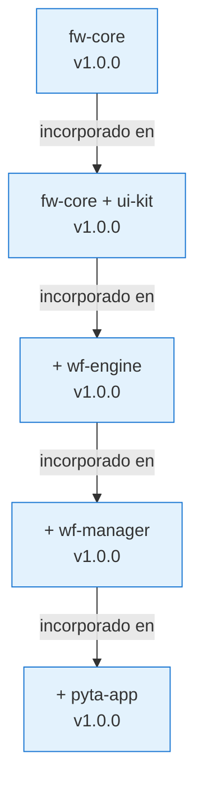

# 📘 MANIFIESTO DE ARQUITECTURA MULTI-REPO

## 📝 SINOPSIS
Documento rector que establece los principios, reglas y estándares para la construcción de un **Sistema Multi-Repo (MR)** diseñado para ser reutilizable, escalable y mantenible. Define la gobernanza técnica, el flujo de trabajo asistido por IA y la estructura documental obligatoria en cada repositorio. **PYTA es el primer proyecto consumidor de este sistema, no su fin último.**

---

## 📑 ÍNDICE

1. **Resumen Ejecutivo**
2. **Propósito del Sistema Multi-Repo**
3. **Alcance y Filosofía**
4. **Arquitectura Técnica**
   - 4.1 Estrategia Multi-Repo
   - 4.2 Modelo de Dependencia Acumulativa
   - 4.3 OpenCode: Agente de Codificación AI *(información verificada)*
5. **Gobernanza y Organización**
   - 5.1 Equipo y Roles
   - 5.2 Entorno de Desarrollo
6. **Estructura Documental por Repositorio**
   - 6.1 Directorio `/definicion-tecnica` (doc-first)
7. **Flujo de Trabajo Git**
   - 7.1 Estrategia de Ramas
   - 7.2 Versionado Semántico *(por definir)*
8. **Reglas Operativas**
9. **Glosario Técnico**

> ⚠️ **Secciones marcadas como "por definir"**: Estructura detallada de repositorios, mecanismo de dependencias y versionado. Se completarán cuando el equipo las especifique.

---

## 🎯 1. RESUMEN EJECUTIVO

**Propósito Central**: Construir un **Sistema Multi-Repo (MR)** robusto, documentado y reutilizable que sirva como base para múltiples proyectos (PYTA, PYTB, PYTC, etc.).

**Enfoque Estratégico**:
- **Arquitectura**: Multi-repositorio desde el día 1
- **Construcción**: Secuencial y acumulativa (cada repo incorpora y valida los anteriores)
- **Equipo**: 1 líder técnico + desarrollo asistido por agente AI (OpenCode en GitHub Codespaces)
- **Automatización**: Sin CI/CD tradicional; validación manual disciplinada
- **Documentación**: Filosofía "doc-first" con especificaciones técnicas obligatorias por repo

**Principios Rectores**:
1. **Reutilización sobre entrega**: Cada repo es un producto independiente, no un entregable de PYTA
2. **Cascada acumulativa**: Repo N = Repo N-1 + nueva capa funcional
3. **Contrato explícito**: Dependencias basadas en versiones SemVer estables *(por definir mecanismo)*
4. **Gobernanza distribuida**: Cada repo replica el manifiesto y aplica las reglas localmente
5. **Asistencia IA verificada**: OpenCode como agente de codificación, no como validador arquitectónico

**Stack Tecnológico**:
- Backend: PHP (framework propio)
- Frontend: React (componentes UI reutilizables)
- Entorno: GitHub Codespaces + OpenCode
- Control de Versiones: Git + GitHub (multi-repo)

---

## 🎯 2. PROPÓSITO DEL SISTEMA MULTI-REPO

### ❌ NO ES
- Un proyecto monolítico para entregar PYTA
- Un conjunto de librerías independientes y desacopladas
- Un repositorio centralizado con módulos internos

### ✅ SÍ ES
- **Un ecosistema de repositorios independientes** que evolucionan en secuencia acumulativa
- **Una base reutilizable** para PYTA, PYTB, PYTC y futuros proyectos no previstos
- **Un sistema de pilares validados** donde cada repo incorpora y estabiliza los anteriores
- **Una arquitectura escalable** que permite reemplazar capas sin afectar el sistema completo

### 🎯 OBJETIVO FINAL: MODELO ACUMULATIVO

```
Repo 1: fw-core                    → Base PHP (routing, config, helpers)
         │
         ▼
Repo 2: fw-core + ui-kit          → Base PHP + Componentes React
         │
         ▼
Repo 3: fw-core + ui-kit + wf-engine  → + Motor de lógica de flujos
         │
         ▼
Repo 4: ... + wf-manager          → + Panel de gestión/administración
         │
         ▼
Repo 5: ... + pyta-app            → + Lógica específica del proyecto A
```

**Características del modelo**:
- Cada repo es **autónomo** y puede versionarse independientemente
- Cada repo **incorpora** funcionalidad de los anteriores, no los consume como dependencia externa *(mecanismo por definir)*
- **PYTA es el primer caso de uso**, no el único: el mismo stack acumulativo puede derivar en PYTB con diferente capa final

---

## 🌍 3. ALCANCE Y FILOSOFÍA

### 🔷 Filosofía "Doc-First"
Cada repositorio **debe** contar con documentación técnica específica **antes** de iniciar el desarrollo de código. Esta documentación define:
- Qué problema resuelve el repo
- Qué NO resuelve (límites explícitos)
- Interfaces y contratos técnicos
- Criterios de aceptación

### 🔷 Construcción en Cascada Acumulativa
- Cada pilar solo inicia cuando el anterior tiene **tag estable** (`v1.0.0` o superior)
- Cada pilar **incorpora físicamente** el código de los anteriores *(mecanismo por definir: submódulos, copias, paquetes)*
- No hay desarrollo paralelo de pilares dependientes

### 🔷 Independencia Controlada
- Cada repo tiene su propio:
  - Historial Git
  - Sistema de versionado SemVer *(reglas por definir)*
  - Documentación
  - Issues y roadmap
- **Sin monorepos ocultos**: cada repo es visible y clonable individualmente

### 🔷 Validación Manual Disciplinada
- Sin CI/CD automatizado
- El líder técnico ejecuta pruebas locales
- Checklist obligatorio antes de crear tags
- Documentación de cambios en `CHANGELOG.md`

---

## 🏗️ 4. ARQUITECTURA TÉCNICA

### 4.1 Estrategia Multi-Repo

**Definición**: Cada componente, librería o servicio vive en su **propio repositorio GitHub**, con autonomía completa.

**Ventajas para tu contexto**:
- ✅ Aislamiento total de responsabilidades
- ✅ Versionado independiente por capa
- ✅ Reutilización sin refactorización estructural
- ✅ Claridad en límites de cada pilar
- ✅ Facilita contribuciones futuras

**Consideraciones**:
- ⚠️ Mayor overhead de gestión → **Mitigado**: 1 solo desarrollador + agente AI
- ⚠️ Coordinación manual de versiones → **Mitigado**: SemVer estricto + tags *(reglas por definir)*
- ⚠️ Sin CI/CD → **Mitigado**: Checklist de validación + disciplina

### 4.2 Modelo de Dependencia Acumulativa



**Estado actual**: El mecanismo técnico de incorporación *(submódulos Git, copias de código, paquetes locales, etc.)* está **por definir**.

### 4.3 OpenCode: Agente de Codificación AI *(información verificada)*

**¿Qué es OpenCode?**
- Agente de codificación AI **de código abierto** (open source) [[13]][[27]]
- Disponible como: interfaz TUI (terminal), aplicación de escritorio, o extensión para IDE [[13]][[17]]
- **No es un IDE**: es un agente que se integra CON IDEs o funciona en terminal

**Agentes integrados** [[8]][[13]]:
| Agente | Modo | Propósito |
|--------|------|-----------|
| `build` | Acceso completo | Desarrollo activo: generar, editar, refactorizar código |
| `plan` | Solo lectura | Análisis y exploración: entender código, proponer planes sin modificar |
| `@general` | Subagente | Tareas complejas: búsquedas multi-paso, coordinación interna |

**Configuración verificada**:
| Archivo | Ubicación | Propósito |
|---------|-----------|-----------|
| `AGENTS.md` | Raíz del proyecto | Instrucciones personalizadas para el agente (similar a reglas de Cursor) [[28]] |
| `opencode.json` | Raíz del proyecto | Configuración: cargar instrucciones externas, plugins, reglas de comportamiento [[20]] |
| `~/.config/opencode/AGENTS.md` | Global (usuario) | Reglas personales aplicadas a todas las sesiones [[13]] |

**Flujo básico** [[13]]:
1. `/init`: Analiza el proyecto y genera/actualiza `AGENTS.md`
2. `/connect`: Configura proveedor de LLM (API keys)
3. `Tab`: Alterna entre modo `build` ↔ `plan`
4. `/undo` / `/redo`: Revierte o rehace cambios del agente

**Límites explícitos**:
- ✅ Genera código, sugiere refactorizaciones, explica bases de código
- ✅ Sigue instrucciones de `AGENTS.md` y `opencode.json`
- ❌ **NO** valida arquitectura, **NO** crea tags Git, **NO** decide promociones a `main`
- ❌ **NO** reemplaza la validación humana ni la disciplina del líder técnico

---

## 👥 5. GOBERNANZA Y ORGANIZACIÓN

### 5.1 Equipo y Roles

**Composición**:
- **1 Líder Técnico**: Arquitecto, desarrollador principal, validador final
- **Agente AI (OpenCode)**: Asistente de codificación con modos `build`/`plan`/`@general`

**Responsabilidades del Líder**:
- Definir especificaciones técnicas en `/definicion-tecnica`
- Validar manualmente cada feature antes de merge
- Crear tags SemVer tras validación *(reglas por definir)*
- Mantener documentación actualizada
- Gestionar la incorporación de repos anteriores en el flujo acumulativo

**Responsabilidades del Agente AI**:
- Generar código boilerplate y sugerir implementaciones
- Analizar código existente y proponer mejoras
- Seguir instrucciones de `AGENTS.md` y `opencode.json`
- **NO**: Validar, crear tags, decidir arquitectura, promocionar a `main`

### 5.2 Entorno de Desarrollo

**Plataforma**: GitHub Codespaces
- Entorno consistente y reproducible
- Acceso desde cualquier dispositivo
- Integración nativa con GitHub

**Herramientas**:
- **OpenCode**: Agente AI de codificación (TUI/IDE/desktop) [[13]][[17]]
- **Git**: Control de versiones
- **PHP + React**: Stack principal
- **Composer + npm**: Gestión de dependencias *(configuración por definir)*

**Configuración Mínima por Repo**:
- `.env.example` versionado (sin secrets)
- `.gitignore` específico por lenguaje
- `AGENTS.md` y `opencode.json` configurados según necesidades del repo

---

## 📚 6. ESTRUCTURA DOCUMENTAL POR REPOSITORIO

### 6.1 Directorio `/definicion-tecnica` (doc-first)

**Ubicación**: Raíz de cada repositorio

**Propósito**: Definir **antes de codificar** qué debe hacer el repo, cómo lo hará y qué límites tiene.

**Contenido mínimo** *(a determinar por cada repo, pero debe incluir)*:
- `ESPECIFICACION.md`: Qué problema resuelve, casos de uso, requisitos funcionales
- `CONTRATO.md`: Interfaces públicas, dependencias de repos anteriores, compatibilidad
- `ARQUITECTURA.md`: Diagramas, patrones de diseño, decisiones técnicas clave
- `CHECKLIST.md`: Criterios de aceptación antes de promocionar a `main`

**Regla operativa**: Ningún commit de código inicia sin que este directorio exista y tenga al menos `ESPECIFICACION.md` aprobado.

---

## 🌿 7. FLUJO DE TRABAJO GIT

### 7.1 Estrategia de Ramas

**Modelo**: `main` + `feat/*` (ligero, adecuado para 1 dev + agente AI)

| Rama | Propósito | Reglas |
|------|-----------|--------|
| `main` | Código estable, versionado | - Solo merges desde `feat/*`<br>- Solo tags SemVer *(reglas por definir)*<br>- Protegida (requiere review manual) |
| `feat/*` | Desarrollo de features | - Una rama por funcionalidad<br>- Se elimina tras merge<br>- Nombre descriptivo: `feat/autenticacion-jwt` |

**Flujo Típico**:
```bash
# 1. Crear rama de feature
git checkout -b feat/nueva-funcionalidad

# 2. Desarrollar con asistencia de OpenCode (modo build/plan)
# (Commits frecuentes, mensajes descriptivos)

# 3. Validar manualmente (pruebas locales, integración con capas anteriores)

# 4. Merge a main
git checkout main
git merge --no-ff feat/nueva-funcionalidad

# 5. Si es estable, crear tag SemVer *(reglas por definir)*
# git tag -a v1.0.0 -m "Lanzamiento estable"
# git push origin main --tags

# 6. Eliminar rama de feature
git branch -d feat/nueva-funcionalidad
```

### 7.2 Versionado Semántico *(por definir)*

> ⚠️ **Estado**: Las reglas específicas de SemVer (cuándo incrementar MAJOR/MINOR/PATCH, formato de tags, comunicación de cambios) están **por definir** por el equipo.

**Principio base**: Cuando se defina, se aplicará estrictamente `MAJOR.MINOR.PATCH` solo en rama `main`, nunca en ramas de feature.

---

## 📜 8. REGLAS OPERATIVAS

| # | Regla | Justificación | Cómo Aplicar |
|---|-------|---------------|--------------|
| **1** | **Doc-First**: Todo repo debe tener `/definicion-tecnica` con especificaciones antes de codificar | Evita desarrollo sin dirección clara | Crear `ESPECIFICACION.md` antes de `git commit` inicial |
| **2** | **Sin commits directos a `main`**: Solo merges desde `feat/*` | Mantiene historial limpio y trazable | `git checkout -b feat/...` siempre |
| **3** | **Tags solo en `main`**: Nunca etiquetar ramas de feature | Garantiza que solo código estable se versiona | Validar en `main`, luego taggear *(reglas por definir)* |
| **4** | **Cascada estricta**: No iniciar repo N hasta que repo N-1 tenga tag estable | Evita acoplamiento prematuro | Verificar tag estable antes de crear nuevo repo |
| **5** | **Manifiesto replicado**: Cada repo debe incluir este documento en `.gobernanza/` | Asegura consistencia transversal | Copiar `.gobernanza/` en cada repo nuevo |
| **6** | **Validación manual obligatoria**: Sin CI/CD, el líder es el gatekeeper | Sustituye automatización con disciplina | Ejecutar checklist pre-promoción siempre |
| **7** | **IA como asistente, no como validador**: OpenCode genera, humano decide | Mantiene control de calidad arquitectónico | Revisar TODO lo generado por el agente antes de commit |
| **8** | **Backup frecuente**: Push a GitHub al finalizar cada sesión | Sin CI/CD, la pérdida de trabajo es el mayor riesgo | `git push` diario mínimo |
| **9** | **AGENTS.md obligatorio**: Cada repo debe configurar instrucciones para el agente | Asegura consistencia en asistencia AI | Ejecutar `/init` al crear repo y mantener actualizado |
| **10** | **Modo plan para cambios estructurales**: Usar agente en modo `plan` antes de refactorizar | Reduce riesgo de cambios no deseados | `Tab` → describir cambio → revisar plan → cambiar a `build` |

---

## 📖 9. GLOSARIO TÉCNICO

| Término | Definición | Uso en MR |
|---------|------------|-----------|
| **Multi-Repo (MR)** | Estrategia donde cada componente vive en su propio repositorio Git | Arquitectura base del sistema |
| **Pilar** | Repositorio que proporciona una capa funcional acumulativa | `fw-core`, `fw-core+ui-kit`, etc. |
| **Doc-First** | Filosofía de documentar antes de codificar | Directorio `/definicion-tecnica` obligatorio |
| **SemVer** | Versionado Semántico (`MAJOR.MINOR.PATCH`) | Estándar para todos los tags *(reglas por definir)* |
| **Tag** | Puntero inmutable en Git que marca una versión específica | `v1.0.0`, `v1.2.3`, etc. |
| **Contrato** | Interfaz pública y comportamiento esperado de un repo | Definido en `/definicion-tecnica/CONTRATO.md` |
| **Cascada Acumulativa** | Flujo secuencial donde cada repo incorpora físicamente los anteriores | `fw-core → fw-core+ui-kit → +wf-engine → ...` |
| **OpenCode** | Agente AI de codificación open source (TUI/IDE/desktop) [[13]] | Asistente de desarrollo en Codespaces |
| **AGENTS.md** | Archivo que configura instrucciones personalizadas para OpenCode [[28]] | En raíz de cada repo |
| **opencode.json** | Configuración de OpenCode: instrucciones externas, plugins, reglas [[20]] | En raíz de cada repo |
| **Modo `build`** | Agente con acceso completo para generar/editar código [[8]] | Desarrollo activo |
| **Modo `plan`** | Agente de solo lectura para análisis y propuestas [[8]] | Exploración y diseño previo |
| **Validación Manual** | Proceso de prueba ejecutado por el líder técnico | Sustituye CI/CD automatizado |

---

**Versión del Documento**: 1.0.0  
**Última Actualización**: Mayo 2026  
**Responsable**: Líder Técnico del Sistema MR  
**Próxima Revisión**: Tras definir mecanismo de incorporación acumulativa y reglas de SemVer

---

## ⏸️ ESTADO ACTUAL

✅ **Documento actualizado** con:
- Título: "Manifiesto de Arquitectura Multi-Repo"
- Sinopsis, Índice y Resumen Ejecutivo
- Modelo de dependencia **acumulativa** (repo N incorpora anteriores)
- Directorio doc-first: **`/definicion-tecnica`**
- OpenCode descrito con **información verificada** (no inventada)
- Secciones no solicitadas (6 y 10 originales) **eliminadas**
- Secciones "por definir" claramente marcadas

⚠️ **Pendiente de definición por el equipo**:
- Mecanismo técnico de incorporación acumulativa (submódulos, copias, paquetes)
- Reglas específicas de SemVer y etiquetado
- Estructura detallada de dependencias entre repos

**Espero tu confirmación o ajustes**. No avanzaré con estructuras, comandos o templates hasta que me lo indiques explícitamente.