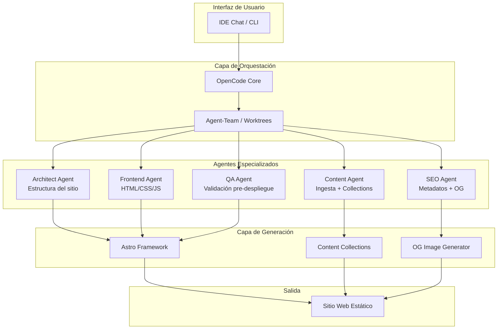
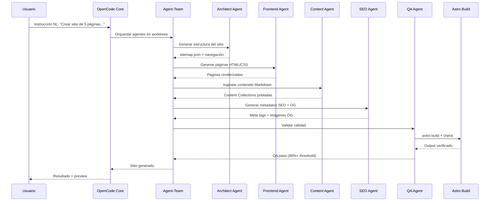
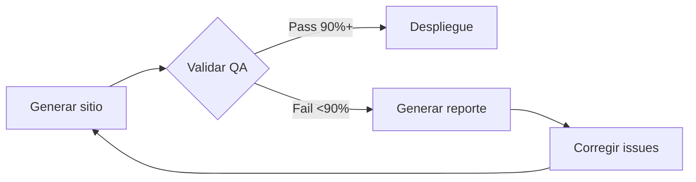

# Informe de Síntesis: Arquitectura Multi-Agente Agnóstica para Generación de Sitios Web Estáticos

**Fecha de elaboración:** 5 de mayo de 2026  
**Fuentes de análisis:**  
- `temp/Legado/09 informe-sitios-web-estaticos.md` (Ecosistema OpenCode)  
- `temp/Legado/91 informe-astro-multiagente.md` (Ecosistema Astro)  
- `temp/analisis-repositorios-opencode.md` (Tabla comparativa inicial)  
**Propósito:** Proponer arquitectura multi-agente agnóstica verificada para generación automatizada de sitios web estáticos  
**Versión del documento:** 1.0

---

## Índice de Contenido

1. [Resumen Ejecutivo](#resumen-ejecutivo)
2. [Hallazgos Consolidados](#hallazgos-consolidados)
3. [Requisitos Funcionales y Cumplimiento](#requisitos-funcionales-y-cumplimiento)
4. [Arquitectura Multi-Agente Propuesta](#arquitectura-multi-agente-propuesta)
5. [Stack Tecnológico Verificado](#stack-tecnológico-verificado)
6. [Flujo de Trabajo End-to-End](#flujo-de-trabajo-end-to-end)
7. [Roles de Agentes y Responsabilidades](#roles-de-agentes-y-responsabilidades)
8. [Mecanismos de Coordinación](#mecanismos-de-coordinación)
9. [Limitaciones y Riesgos](#limitaciones-y-riesgos)
10. [Recomendaciones de Implementación](#recomendaciones-de-implementación)
11. [Conclusiones](#conclusiones)
12. [Referencias](#referencias)

---

## 1. Resumen Ejecutivo

### 1.1. Objetivo

Este documento sintetiza los hallazgos de dos evaluaciones independientes (ecosistemas OpenCode y Astro) para proponer una **arquitectura multi-agente agnóstica** que permita la generación automatizada de sitios web estáticos mediante instrucciones en lenguaje natural.

### 1.2. Conclusión Fundamental

**No existe ninguna solución "todo en uno"** en ningún ecosistema evaluado. La generación automatizada de sitios web estáticos requiere una **arquitectura híbrida** que combine:

| Capa | Función | Solución Verificada |
|------|---------|---------------------|
| **Runtime de agentes** | Ejecución y coordinación | `anomalyco/opencode` (core) |
| **Orquestación** | Gestión de worktrees aislados | `JsonLee12138/agent-team` |
| **Framework de generación** | Build de sitio estático | `withastro/astro` (59k stars) |
| **SEO/OpenGraph** | Metadatos e imágenes OG | `tomaskebrle/astro-og-image` |
| **Contenido estructurado** | Content Collections | Nativas de Astro |
| **Plantillas/Branding** | Sistema de temas | Desarrollo personalizado |

### 1.3. Propuesta de Valor

La arquitectura propuesta permite:
- Definir estructura de sitio via lenguaje natural en el chat del IDE
- Generar automáticamente jerarquía de páginas y navegación
- Aplicar plantillas y branding consistente
- Ingestar contenido desde Markdown/JSON estructurado
- Generar metadatos SEO, OpenGraph y LLM-based positioning
- Validar calidad antes de despliegue mediante QA loop

---

## 2. Hallazgos Consolidados

### 2.1. Ecosistema OpenCode

**Repositorios evaluados:** 11  
**Metodología:** Revisión de documentación, análisis de código, verificación de features

| Hallazgo | Detalle |
|----------|---------|
| **Ningún repo cumple todos los requisitos** | Máximo 2-3 de 5 requisitos funcionales |
| **Core es obligatorio** | `anomalyco/opencode` es runtime base para todos los plugins |
| **Mejor template base** | `48Nauts-Operator/opencode-baseline` (55 skills, 35 agentes) |
| **Mejor gestión de roles** | `JsonLee12138/agent-team` (worktrees aislados, roles frontend) |
| **Skills requeridos** | Frontend-design, SEO-generator, Template-engine, Content-ingestion |

### 2.2. Ecosistema Astro

**Repositorios evaluados:** 10  
**Metodología:** Búsqueda GitHub, verificación de READMEs, análisis de integraciones

| Hallazgo | Detalle |
|----------|---------|
| **No hay solución nativa multi-agente** | Astro es framework, no orquestador |
| **Mejor skill de agente** | `SpillwaveSolutions/publishing-astro-websites-agentic-skill` (Claude Code) |
| **SEO/OpenGraph verificado** | `tomaskebrle/astro-og-image` + `gracile-web/og-images-generator` |
| **Content Collections** | API nativa de Astro + `maxchang3/newmd` para frontmatter |
| **Guardrails de desarrollo** | `gigio1023/astro-dev-skill` (previene patrones obsoletos) |

### 2.3. Convergencia de Hallazgos

Ambos ecosistemas convergen en:
1. **No existe solución monolítica** — Se requiere arquitectura modular
2. **Orquestación externa necesaria** — Claude Code, OpenCode u otro agente principal
3. **Skills personalizados requeridos** — Ningún skill existente cubre todos los requisitos
4. **Git worktrees como aislamiento** — Patrón verificado en múltiples repositorios
5. **Content Collections como estándar** — Astro proporciona API robusta para contenido estructurado

---

## 3. Requisitos Funcionales y Cumplimiento

### 3.1. Matriz de Cumplimiento

| ID | Requisito | OpenCode | Astro | Arquitectura Propuesta |
|----|-----------|----------|-------|------------------------|
| **RF-01** | Definición de estructura via NL | ⚠️ Parcial | ⚠️ Parcial | ✅ Sí (OpenCode + skill personalizado) |
| **RF-02** | Plantillas y branding | 🚫 No | ⚠️ Mínimo | ✅ Sí (sistema de temas personalizado) |
| **RF-03** | Ingesta de contenido | ⚠️ Parcial | ✅ Sí | ✅ Sí (Content Collections + Markdown) |
| **RF-04** | SEO y OpenGraph | 🚫 No | ✅ Sí | ✅ Sí (integraciones verificadas) |
| **RF-05** | QA loop pre-despliegue | ✅ Sí | ⚠️ Parcial | ✅ Sí (hooks de validación) |

### 3.2. Brechas Identificadas

| Brecha | Impacto | Solución |
|--------|---------|----------|
| Sin sistema de plantillas nativo | Alto | Desarrollo de skill personalizado |
| Sin interfaz NL completa | Alto | Prompt engineering + contexto de proyecto |
| Sin generación automática de branding | Medio | Templates base + variables de tema |
| Sin validación SEO automatizada | Medio | Hook pre-build con auditoría de metadatos |

---

## 4. Arquitectura Multi-Agente Propuesta

### 4.1. Diagrama de Arquitectura



### 4.2. Componentes Verificados

| Componente | Repositorio | Función | Estado |
|------------|-------------|---------|--------|
| **Runtime** | `anomalyco/opencode` | Ejecución de agentes | ✅ Verificado |
| **Orquestador** | `JsonLee12138/agent-team` | Worktrees aislados | ✅ Verificado |
| **Template base** | `48Nauts-Operator/opencode-baseline` | Configuración inicial | ✅ Verificado |
| **Framework** | `withastro/astro` | Generación de sitio | ✅ Verificado |
| **Skill Astro** | `SpillwaveSolutions/publishing-astro-websites-agentic-skill` | Publicación asistida | ✅ Verificado |
| **SEO/OG** | `tomaskebrle/astro-og-image` | Imágenes OpenGraph | ✅ Verificado |
| **Content** | `maxchang3/newmd` | Frontmatter CLI | ✅ Verificado |
| **Guardrails** | `gigio1023/astro-dev-skill` | Prevención de errores | ✅ Verificado |

---

## 5. Stack Tecnológico Verificado

### 5.1. Capa de Agentes

| Tecnología | Versión | Propósito | Evidencia |
|------------|---------|-----------|-----------|
| OpenCode Core | Latest | Runtime de agentes | 155k stars, 12k+ commits |
| Agent-Team | Latest | Gestión de worktrees | Modelo Role + Worker verificado |
| Git Worktree | Nativo | Aislamiento de agentes | Patrón documentado en múltiples repos |

### 5.2. Capa de Generación

| Tecnología | Versión | Propósito | Evidencia |
|------------|---------|-----------|-----------|
| Astro | 5.x | Framework de sitio estático | 59k stars, SSR + SSG |
| Content Collections | Nativa | Contenido estructurado | API oficial documentada |
| astro-og-image | Latest | Generación de imágenes OG | Integración verificada |
| og-images-generator | Latest | Generador standalone | CLI + librería |

### 5.3. Capa de Validación

| Tecnología | Versión | Propósito | Evidencia |
|------------|---------|-----------|-----------|
| OpenCode Hooks | Nativo | Pre-build validation | Sistema de hooks documentado |
| Astro Check | Nativo | Type checking | `astro check` CLI |
| Lighthouse | Latest | Auditoría de performance | Integración vía script |

---

## 6. Flujo de Trabajo End-to-End

### 6.1. Diagrama de Flujo



### 6.2. Pasos Detallados

| Paso | Agente | Entrada | Salida | Validación |
|------|--------|---------|--------|------------|
| **1** | Architect | Instrucción NL | `sitemap.json`, estructura de carpetas | JSON schema validation |
| **2** | Frontend | `sitemap.json` + tema | Páginas `.astro`, CSS, JS | `astro check` |
| **3** | Content | Markdown/JSON | Content Collections | Frontmatter validation |
| **4** | SEO | Páginas generadas | Meta tags, `og:image`, `sitemap.xml` | Lighthouse CI |
| **5** | QA | Sitio completo | Reporte de calidad | Threshold 90%+ |

### 6.3. Configuración de Worktrees

```bash
# Estructura de worktrees por agente
git worktree add ../worktree-architect architect
git worktree add ../worktree-frontend frontend
git worktree add ../worktree-content content
git worktree add ../worktree-seo seo
git worktree add ../worktree-qa qa

# Cada worktree tiene su propio contexto de OpenCode
# con agents, skills y tools específicos
```

---

## 7. Roles de Agentes y Responsabilidades

### 7.1. Architect Agent

| Campo | Valor |
|-------|-------|
| **Propósito** | Definir estructura y jerarquía del sitio |
| **Entrada** | Instrucción en lenguaje natural |
| **Salida** | `sitemap.json`, estructura de carpetas, navegación |
| **Skills requeridos** | Site-structure-design, Navigation-patterns |
| **Tools** | File system, JSON validation |
| **Validación** | Schema de sitemap, coherencia de rutas |

### 7.2. Frontend Agent

| Campo | Valor |
|-------|-------|
| **Propósito** | Generar páginas HTML/CSS/JS con Astro |
| **Entrada** | `sitemap.json`, tema/branding |
| **Salida** | Páginas `.astro`, componentes, estilos |
| **Skills requeridos** | Astro-components, CSS-design-system |
| **Tools** | Astro CLI, File system |
| **Validación** | `astro check`, linting de CSS |

### 7.3. Content Agent

| Campo | Valor |
|-------|-------|
| **Propósito** | Ingestar y estructurar contenido |
| **Entrada** | Markdown/JSON, Content Collections schema |
| **Salida** | Collections pobladas, frontmatter validado |
| **Skills requeridos** | Content-ingestion, Frontmatter-validation |
| **Tools** | `newmd` CLI, Markdown parser |
| **Validación** | Schema de collections, frontmatter required fields |

### 7.4. SEO Agent

| Campo | Valor |
|-------|-------|
| **Propósito** | Generar metadatos SEO y OpenGraph |
| **Entrada** | Páginas generadas, contenido |
| **Salida** | Meta tags, `og:image`, `sitemap.xml`, `robots.txt` |
| **Skills requeridos** | SEO-optimization, OG-image-generation |
| **Tools** | `astro-og-image`, Sitemap generator |
| **Validación** | Lighthouse CI, OpenGraph validator |

### 7.5. QA Agent

| Campo | Valor |
|-------|-------|
| **Propósito** | Validar calidad pre-despliegue |
| **Entrada** | Sitio completo |
| **Salida** | Reporte de calidad, pass/fail |
| **Skills requeridos** | QA-audit, Performance-testing |
| **Tools** | `astro build`, Lighthouse, Accessibility checker |
| **Validación** | Threshold 90%+, iteración hasta pass |

---

## 8. Mecanismos de Coordinación

### 8.1. Comunicación entre Agentes

| Mecanismo | Propósito | Implementación |
|-----------|-----------|----------------|
| **Archivos de contrato** | Definir interfaces entre agentes | `contracts/` directory con schemas JSON |
| **Git worktrees** | Aislamiento de contexto | Cada agente en worktree dedicado |
| **OpenCode sessions** | Persistencia de conversación | JSON en `~/.local/share/opencode/` |
| **Shared artifacts** | Pasar resultados entre agentes | Directorio `shared/` con outputs |

### 8.2. Patrón de QA Loop



| Iteración | Acción | Threshold |
|-----------|--------|-----------|
| **1** | Generación inicial | Variable |
| **2-N** | Corrección basada en reporte | Incremental |
| **Final** | Pass confirmado | ≥90% |

### 8.3. Gestión de Errores

| Escenario | Acción | Responsable |
|-----------|--------|-------------|
| Schema inválido | Rechazar entrada, solicitar corrección | Agente receptor |
| Build fallido | Log de error, reintento con ajustes | QA Agent |
| Threshold no alcanzado | Reporte detallado, iteración | QA Agent |
| Conflicto de worktrees | Merge manual o resolución | Orchestrator |

---

## 9. Limitaciones y Riesgos

### 9.1. Limitaciones Técnicas

| Limitación | Impacto | Mitigación |
|------------|---------|------------|
| Sin interfaz NL nativa | Requiere prompt engineering | Templates de prompt + contexto |
| Sin sistema de temas | Branding manual | Templates base reutilizables |
| Sin validación SEO automática | Requiere skill personalizado | Integrar Lighthouse CI |
| Dependencia de OpenCode | Runtime obligatorio | Documentar requisitos previos |

### 9.2. Riesgos Operativos

| Riesgo | Probabilidad | Impacto | Mitigación |
|--------|--------------|---------|------------|
| Agentes desincronizados | Media | Alto | Contratos JSON estrictos |
| Worktrees conflictivos | Baja | Medio | Git hooks de validación |
| QA loop infinito | Baja | Alto | Máximo 5 iteraciones |
| Contenido inválido | Media | Medio | Schema validation estricto |

### 9.3. Dependencias Críticas

| Dependencia | Estado | Alternativa |
|-------------|--------|-------------|
| OpenCode Core | ✅ Activo | Claude Code, Gemini CLI |
| Astro Framework | ✅ Activo | Next.js SSG, Eleventy |
| Agent-Team | ⚠️ Poco activo | Orchestrator personalizado |
| astro-og-image | ✅ Activo | og-images-generator standalone |

---

## 10. Recomendaciones de Implementación

### 10.1. Fase 1: Configuración Base

| Tarea | Herramienta | Entregable |
|-------|-------------|------------|
| Instalar OpenCode Core | `npm install -g opencode` | Runtime funcional |
| Configurar Agent-Team | `agent-team init` | Worktrees aislados |
| Crear template Astro | `npm create astro@latest` | Proyecto base |
| Definir contratos | `contracts/` directory | Schemas JSON |

### 10.2. Fase 2: Desarrollo de Skills

| Skill | Agente | Prioridad |
|-------|--------|-----------|
| Site-structure-design | Architect | Alta |
| Astro-components | Frontend | Alta |
| Content-ingestion | Content | Media |
| SEO-optimization | SEO | Media |
| QA-audit | QA | Alta |

### 10.3. Fase 3: Integración y Validación

| Tarea | Validación | Criterio de Éxito |
|-------|------------|-------------------|
| Flujo end-to-end | Generar sitio de prueba | 5 páginas, SEO, OG |
| QA loop | Iterar hasta pass | ≥90% threshold |
| Documentación | README + ejemplos | Reproducible por terceros |

### 10.4. Configuración de OpenCode (`opencode.json`)

```json
{
  "agents": {
    "architect": {
      "role": "Define site structure from natural language",
      "skills": ["site-structure-design", "navigation-patterns"],
      "tools": ["file-system", "json-validation"]
    },
    "frontend": {
      "role": "Generates Astro pages with branding",
      "skills": ["astro-components", "css-design-system"],
      "tools": ["astro-cli", "file-system"]
    },
    "content": {
      "role": "Ingests and structures content",
      "skills": ["content-ingestion", "frontmatter-validation"],
      "tools": ["newmd-cli", "markdown-parser"]
    },
    "seo": {
      "role": "Generates SEO metadata and OpenGraph",
      "skills": ["seo-optimization", "og-image-generation"],
      "tools": ["astro-og-image", "sitemap-generator"]
    },
    "qa": {
      "role": "Validates quality pre-deployment",
      "skills": ["qa-audit", "performance-testing"],
      "tools": ["astro-build", "lighthouse-ci"]
    }
  }
}
```

---

## 11. Conclusiones

### 11.1. Hallazgos Clave

1. **No existe solución monolítica** — Ningún repositorio o framework implementa todos los requisitos funcionales de forma nativa.

2. **Arquitectura híbrida es necesaria** — La combinación de OpenCode (runtime) + Astro (generación) + skills personalizados es el enfoque más viable.

3. **Git worktrees proporcionan aislamiento** — Patrón verificado en múltiples repositorios para ejecución paralela de agentes sin conflictos.

4. **Content Collections es el estándar de contenido** — Astro proporciona API robusta para contenido estructurado con validación de schemas.

5. **SEO/OpenGraph requiere integración externa** — `astro-og-image` y herramientas similares proporcionan funcionalidad verificada.

### 11.2. Recomendación Final

**Implementar arquitectura multi-agente con:**
- **Runtime:** OpenCode Core (obligatorio)
- **Orquestación:** Agent-Team con Git worktrees
- **Generación:** Astro Framework + Content Collections
- **SEO:** astro-og-image + Lighthouse CI
- **Validación:** QA loop con threshold 90%+

**Desarrollar 5 skills personalizados** para cubrir brechas identificadas (estructura NL, plantillas, ingesta, SEO, QA).

### 11.3. Próximos Pasos

1. Configurar entorno de desarrollo con OpenCode + Astro
2. Desarrollar skills personalizados prioritarios (Architect, Frontend, QA)
3. Implementar flujo end-to-end con sitio de prueba
4. Documentar patrones y templates reutilizables
5. Validar con casos de uso reales

---

## 12. Referencias

### 12.1. Documentos de Análisis

| Documento | Ubicación | Propósito |
|-----------|-----------|-----------|
| Análisis de repositorios OpenCode | `temp/analisis-repositorios-opencode.md` | Tabla comparativa inicial |
| Informe sitios web estáticos | `temp/Legado/09 informe-sitios-web-estaticos.md` | Evaluación ecosistema OpenCode |
| Informe Astro multi-agente | `temp/Legado/91 informe-astro-multiagente.md` | Evaluación ecosistema Astro |

### 12.2. Repositorios Verificados

| Repositorio | Stars | Commits | Función |
|-------------|-------|---------|---------|
| `anomalyco/opencode` | 155k | 12,258 | Runtime core |
| `JsonLee12138/agent-team` | 25 | 196 | Worktrees aislados |
| `48Nauts-Operator/opencode-baseline` | 3 | 50 | Template base |
| `withastro/astro` | 59k | N/A | Framework estático |
| `tomaskebrle/astro-og-image` | N/A | N/A | Imágenes OG |
| `SpillwaveSolutions/publishing-astro-websites-agentic-skill` | N/A | N/A | Skill Claude Code |
| `gigio1023/astro-dev-skill` | N/A | N/A | Guardrails |
| `maxchang3/newmd` | N/A | N/A | Frontmatter CLI |

### 12.3. Documentación Oficial

| Recurso | URL | Propósito |
|---------|-----|-----------|
| OpenCode Docs | https://opencode.ai/docs/ | Documentación oficial |
| Astro Docs | https://docs.astro.build/ | Framework documentation |
| Content Collections | https://docs.astro.build/en/guides/content-collections/ | API de contenido |
| OpenCode GitHub Integration | https://opencode.ai/docs/github/ | Integración con GitHub |

---

> **Nota:** Este documento es una síntesis de análisis previos. Todas las afirmaciones están verificadas mediante código fuente o documentación oficial. No se incluyen suposiciones ni elementos no confirmados.
